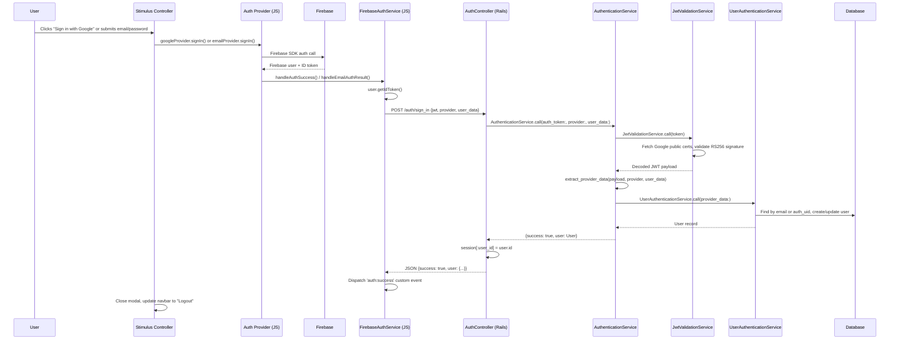
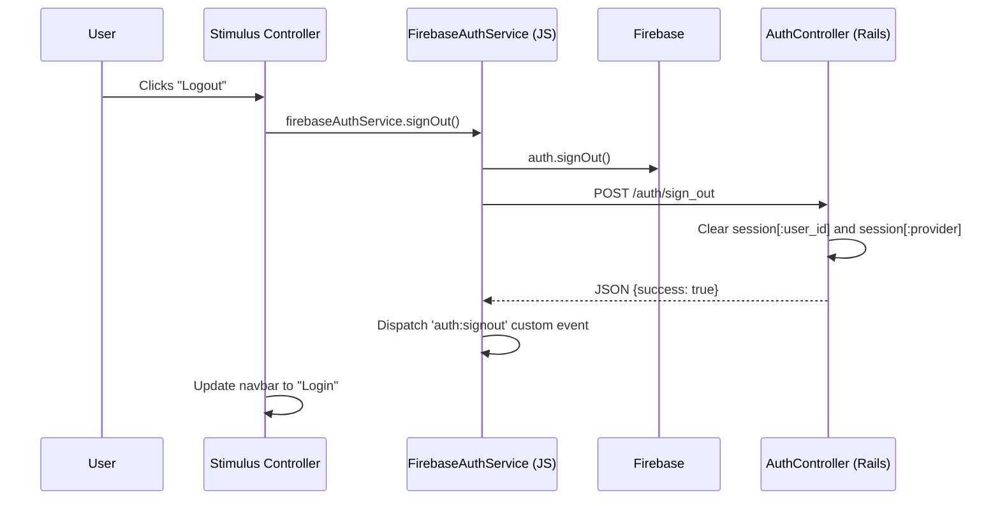
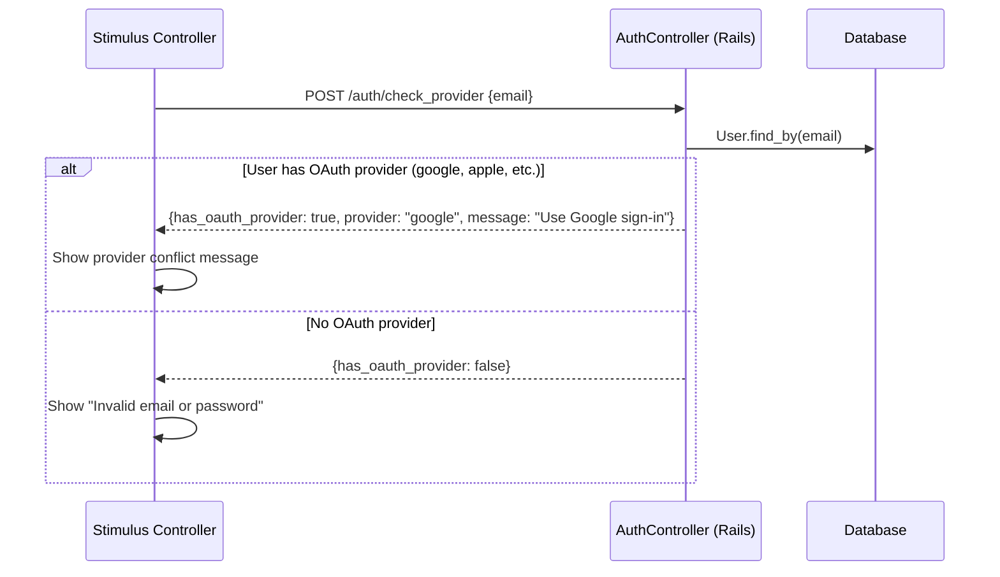

# Authentication

## Overview
The Greatest uses **Firebase Authentication** on the client side with a **Rails session-based backend**. Users authenticate via Firebase (Google OAuth or email/password), the frontend sends a JWT to Rails, Rails validates it and creates a session. All subsequent requests use standard Rails cookie sessions.

After authentication, **authorization** is handled by a separate domain-scoped system documented in [Domain-Scoped Authorization](domain-scoped-authorization.md).

## Architecture

The authentication system spans three layers:

1. **Frontend** - Firebase SDK + Stimulus controllers + singleton JS services
2. **Backend** - Rails controller + service layer (JWT validation, user find/create)
3. **Session** - Standard Rails cookie session (`session[:user_id]`)

### Sign-In Flow



### Sign-Out Flow



### Provider Conflict Check

When email/password sign-in fails, the frontend checks if the email is associated with an OAuth provider:



## Supported Providers

| Provider | Status | Firebase Provider ID | User enum value |
|----------|--------|---------------------|-----------------|
| Google | Implemented | `google.com` | `google` (2) |
| Email/Password | Implemented | `password` | `password` (4) |
| Apple | Enum defined, not implemented | `apple.com` | `apple` (3) |
| Facebook | Enum defined, not implemented | `facebook.com` | `facebook` (0) |
| Twitter | Enum defined, not implemented | `twitter.com` | `twitter` (1) |

**Important**: Firebase uses `"google.com"` as the `providerId` for OAuth providers but just `"password"` for email/password (no `.com` suffix). The `AuthenticationService.extract_provider_data` handles this by searching for both `"#{provider}.com"` and `"#{provider}"` in the `providerData` array.

## Key Files

> All file paths below are relative to the `web-app/` directory.

### Frontend (JavaScript)

| File | Purpose |
|------|---------|
| `app/javascript/services/firebase_auth_service.js` | Central auth orchestrator (singleton). Initializes Firebase, manages auth state listeners, sends JWT to backend, dispatches custom events (`auth:success`, `auth:error`, `auth:signout`) |
| `app/javascript/services/auth_providers/google_provider.js` | Google OAuth provider (singleton). Configures `GoogleAuthProvider` with profile/email scopes, initiates `signInWithRedirect()` |
| `app/javascript/services/auth_providers/email_provider.js` | Email/password provider (singleton). Handles sign-up, sign-in, password reset, email verification. Maps Firebase error codes to user-friendly messages |
| `app/javascript/services/auth_handlers/redirect_handler.js` | Handles OAuth redirect results on page load (singleton). Processes redirect auth result, handles account conflict errors |
| `app/javascript/controllers/authentication_controller.js` | Stimulus controller for the auth UI. Manages multi-step email flow, Google sign-in button, navbar login/logout toggle, modal open/close, provider conflict detection |

### Frontend (ViewComponent)

| File | Purpose |
|------|---------|
| `app/components/authentication/widget_component.rb` | ViewComponent that renders the auth widget. Accepts `reload_after_auth` and `css_class` parameters |
| `app/components/authentication/widget_component/widget_component.html.erb` | Auth widget template. Multi-step UI: email entry (with Google button) -> password entry (sign-in/sign-up toggle, forgot password link). Forgot password is an alternate view that replaces the password step |

### Backend (Rails)

| File | Purpose |
|------|---------|
| `app/controllers/auth_controller.rb` | Auth endpoints: `sign_in` (validate JWT, create session), `sign_out` (clear session), `check_provider` (detect OAuth conflicts). Skips CSRF for JSON requests |
| `app/lib/services/authentication_service.rb` | Main auth orchestrator. Coordinates JWT validation -> data extraction -> user find/create. Handles provider naming quirks |
| `app/lib/services/jwt_validation_service.rb` | Validates Firebase JWT using Google's public RS256 certificates. Fetches certs from `googleapis.com`, verifies signature and audience |
| `app/lib/services/user_authentication_service.rb` | Finds existing users by email (case-insensitive) or `auth_uid`. Creates new users or updates existing ones. Stores `provider_data` as JSON, tracks `sign_in_count` |
| `app/controllers/application_controller.rb` | Defines `current_user` (reads `session[:user_id]`) and `signed_in?` helpers. Sets `current_domain` based on request host |
| `app/models/user.rb` | User model with `external_provider` enum, `auth_uid`, `email_verified`, domain role methods. See schema at top of file |

### Configuration

| File | Purpose |
|------|---------|
| `config/routes.rb` | Auth routes: `POST /auth/sign_in`, `POST /auth/sign_out`, `POST /auth/check_provider` |
| `config/initializers/domain_config.rb` | Domain hostnames from ENV variables. Used by `ApplicationController#detect_current_domain` |
| `app/lib/domain_constraint.rb` | Route constraint class for multi-domain routing |

### JS Bundling

Each domain has its own Rollup entry point that imports the auth services:

| File | Domain |
|------|--------|
| `app/javascript/application.js` | Books (default) |
| `app/javascript/music.js` | Music |
| `app/javascript/movies.js` | Movies |
| `app/javascript/games.js` | Games |
| `app/javascript/books.js` | Books |
| `rollup.config.js` | Rollup bundler config (separate IIFE bundles per domain) |

### Authorization (post-authentication)

| File | Purpose |
|------|---------|
| `app/controllers/admin/base_controller.rb` | `authenticate_admin!` requires global admin/editor. Domain controllers override this to allow domain roles. Helper methods: `current_user_can_write?`, `current_user_can_delete?`, `current_user_can_manage?` |
| `app/controllers/admin/music/base_controller.rb` | Overrides `authenticate_admin!` to allow music domain roles (pattern repeated for games) |
| `app/policies/application_policy.rb` | Base Pundit policy. Global admin/editor bypass all domain checks. CRUD mapped to domain role permissions |
| `app/models/domain_role.rb` | Domain-specific roles (viewer/editor/moderator/admin) per domain |

See [Domain-Scoped Authorization](domain-scoped-authorization.md) for full authorization documentation.

### Tests

| File | Purpose |
|------|---------|
| `test/test_helper.rb` | Defines `sign_in_as(user, stub_auth:)` helper for integration tests |
| `test/controllers/auth_controller_test.rb` | Tests sign_in, sign_out, and check_provider endpoints |
| `test/lib/services/authentication_service_test.rb` | Tests the auth orchestrator service |
| `test/lib/services/jwt_validation_service_test.rb` | Tests JWT validation with mocked Google certs |
| `test/lib/services/user_authentication_service_test.rb` | Tests user find/create logic |
| `test/fixtures/users.yml` | User fixtures with different roles and providers |
| `test/fixtures/domain_roles.yml` | Domain role fixtures for authorization tests |

## Key Patterns

### Singleton Services
All frontend auth services use the singleton pattern - a single instance is created and exported:
```javascript
const firebaseAuthService = new FirebaseAuthService()
export default firebaseAuthService
```

### Custom Events for Decoupling
The frontend uses `CustomEvent` to decouple auth state from UI updates:
- `auth:success` - Backend confirmed authentication
- `auth:error` - Auth failure (with error message in `detail`)
- `auth:signout` - User signed out

### Navbar Button Convention
All domain layouts include a button with `id="navbar_login_button"` that the Stimulus controller dynamically toggles between "Login" (opens modal) and "Logout" (calls `signOut()`).

### Session-Based Backend Auth
Despite using Firebase JWTs for initial authentication, the backend uses traditional Rails cookie sessions. The JWT is only used once during sign-in; all subsequent requests authenticate via `session[:user_id]`.

### Sign-Out Duplication (Known Issue)
The Stimulus controller's `signOut()` method calls `firebaseAuthService.signOut()` (which calls `POST /auth/sign_out`) and then also makes its own separate call to `POST /auth/sign_out`. This results in two calls to the backend endpoint. Both code paths should be considered when modifying the sign-out flow.

### Test Helper
Integration tests use `sign_in_as(user, stub_auth: true)` to bypass JWT validation entirely. Only auth-specific tests actually exercise the JWT validation flow.

## Adding a New Auth Provider

To add a new Firebase auth provider (e.g., Apple, GitHub), changes are needed at every layer:

### Frontend
1. **Create a new provider singleton** in `app/javascript/services/auth_providers/` following the pattern of `google_provider.js` or `email_provider.js`. Import the relevant Firebase auth method (e.g., `signInWithRedirect` for OAuth, direct methods for others).
2. **Update the Stimulus controller** (`authentication_controller.js`) to add a new action method (e.g., `signInWithApple`) that calls the new provider.
3. **Update the widget template** (`widget_component.html.erb`) to add a new sign-in button wired to the Stimulus action.
4. **Import the new provider** in each domain entry point (`application.js`, `music.js`, `movies.js`, `games.js`, `books.js`).

### Backend
5. **Add the provider to the User enum** in `app/models/user.rb` if not already present. The enum is integer-backed so add new values at the end to avoid breaking existing data.
6. **Handle provider ID format** - If the new provider uses a `.com` suffix in Firebase's `providerId` (e.g., `apple.com`), the existing `AuthenticationService.extract_provider_data` already handles it. If the provider uses a different format, update the `provider_ids` logic.
7. **Update `check_provider`** in `auth_controller.rb` - The `oauth_providers` array already includes `apple`, `facebook`, `twitter`. Add any new provider name there.

### Firebase Console
8. **Enable the provider** in the Firebase Console under Authentication > Sign-in method.

### Tests
9. **Add a user fixture** with the new provider in `test/fixtures/users.yml`.
10. **Add tests** for the new provider in `auth_controller_test.rb` and `authentication_service_test.rb`.

### Gotchas
- Firebase uses `"google.com"` as `providerId` for OAuth but just `"password"` for email/password - don't assume a `.com` suffix for all providers.
- OAuth providers use redirect-based flow (`signInWithRedirect`), which requires the `redirect_handler.js` to process results on page load.
- The `external_provider` enum is integer-backed: `facebook=0, twitter=1, google=2, apple=3, password=4`. New values must be appended.
- All domain Rollup entry points must import the new provider for it to be available across all domains.

## Related Documentation
- [Domain-Scoped Authorization](domain-scoped-authorization.md) - Authorization system (roles, permissions, policies)
