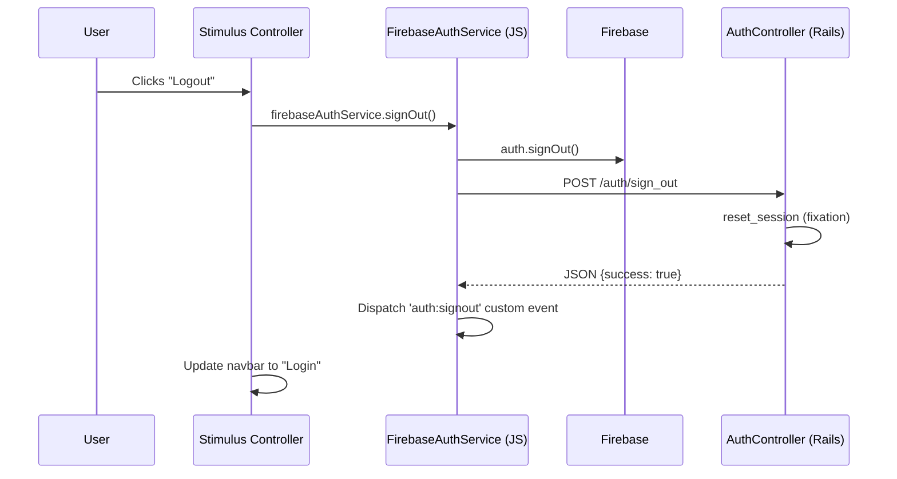
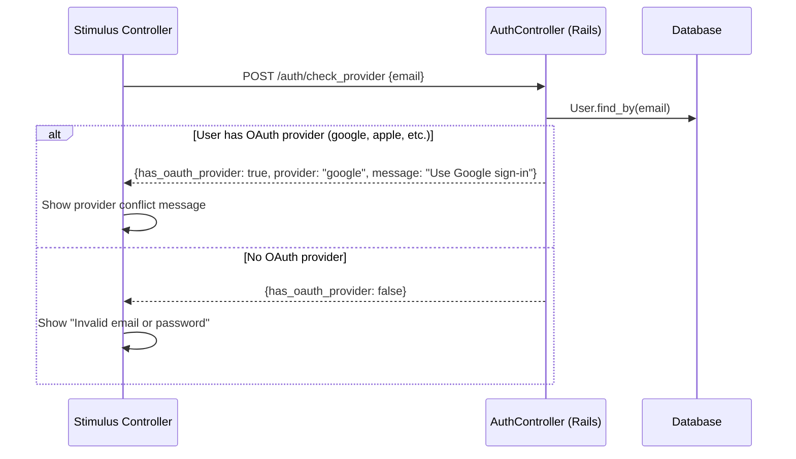

# Authentication

## Overview
The Greatest uses **Firebase Authentication** on the client side with a **Rails session-based backend**. Users authenticate via Firebase (Google, Apple, Facebook, X, or email/password), the frontend sends a JWT to Rails, Rails validates it and creates a session. All subsequent requests use standard Rails cookie sessions.

After authentication, **authorization** is handled by a separate domain-scoped system documented in [Domain-Scoped Authorization](domain-scoped-authorization.md).

## Architecture

The authentication system spans three layers:

1. **Frontend** - Firebase SDK + Stimulus controllers + singleton JS services
2. **Backend** - Rails controller + service layer (JWT validation, user find/create)
3. **Session** - Standard Rails cookie session (`session[:user_id]`)

### Sign-In Flow

```mermaid
sequenceDiagram
    participant U as User
    participant S as Stimulus Controller
    participant FP as Auth Provider (JS)
    participant FB as Firebase
    participant FAS as FirebaseAuthService (JS)
    participant RC as AuthController (Rails)
    participant AS as AuthenticationService
    participant JWT as JwtValidationService
    participant UAS as UserAuthenticationService
    participant DB as Database

    U->>S: Clicks "Sign in with Google" or submits email/password
    S->>FP: googleProvider.signIn() or emailProvider.signIn()
    FP->>FB: Firebase SDK auth call
    FB-->>FP: Firebase user + ID token
    FP->>FAS: handleAuthSuccess() / handleEmailAuthResult()
    FAS->>FAS: user.getIdToken()
    FAS->>RC: POST /auth/sign_in {jwt}
    RC->>AS: AuthenticationService.call(auth_token:, project_id:, signup_domain:)
    AS->>JWT: JwtValidationService.call(token, project_id:)
    JWT->>JWT: Cached Google certs; verify RS256 signature, aud, iss, sub
    JWT-->>AS: Decoded JWT payload
    AS->>AS: extract_provider_data(payload)
    AS->>UAS: UserAuthenticationService.call(provider_data:, signup_domain:)
    UAS->>DB: Find by auth_uid, else by a TRUSTED-provider email (resolved from the provider record on a uid miss), else create
    UAS-->>AS: User record
    AS-->>RC: {success: true, user: User}
    RC->>RC: reset_session (fixation)
    RC->>RC: session[:user_id] = user.id
    RC-->>FAS: JSON {success: true, user: {...}}
    FAS->>FAS: Dispatch 'auth:success' custom event
    S->>S: Close modal, update navbar to "Logout"
```

### Sign-Out Flow


```mermaid
sequenceDiagram
    participant U as User
    participant S as Stimulus Controller
    participant FAS as FirebaseAuthService (JS)
    participant FB as Firebase
    participant RC as AuthController (Rails)

    U->>S: Clicks "Logout"
    S->>FAS: firebaseAuthService.signOut()
    FAS->>FB: auth.signOut()
    FAS->>RC: POST /auth/sign_out
    RC->>RC: reset_session (fixation)
    RC-->>FAS: JSON {success: true}
    FAS->>FAS: Dispatch 'auth:signout' custom event
    S->>S: Update navbar to "Login"
```

### Provider Conflict Check

When email/password sign-in fails, the frontend checks if the email is associated with an OAuth provider:


```mermaid
sequenceDiagram
    participant S as Stimulus Controller
    participant RC as AuthController (Rails)
    participant DB as Database

    S->>RC: POST /auth/check_provider {email}
    RC->>DB: User.find_by(email)
    alt User has OAuth provider (google, apple, etc.)
        RC-->>S: {has_oauth_provider: true, provider: "google", message: "Use Google sign-in"}
        S->>S: Show provider conflict message
    else No OAuth provider
        RC-->>S: {has_oauth_provider: false}
        S->>S: Show "Invalid email or password"
    end
```

## Supported Providers

| Provider | Status | Firebase Provider ID | User enum value |
|----------|--------|---------------------|-----------------|
| Google | Implemented | `google.com` | `google` (2) |
| Email/Password | Implemented | `password` | `password` (4) |
| Apple | Implemented | `apple.com` | `apple` (3) |
| Facebook | Implemented | `facebook.com` | `facebook` (0) |
| X (Twitter) | Implemented | `twitter.com` | `twitter` (1) |

The four OAuth providers are declared in `config/auth_providers.json`; [OAuth providers](oauth-providers.md) is the guide to adding one and to what each does differently.

## Security model

Everything the server trusts comes out of a signature-verified token. The
request body carries the JWT and nothing else.

| Property | Enforced by |
|---|---|
| Token really is Firebase's | RS256 verified against Google's certs; `ALGORITHM` is a constant, never read from the token header |
| Token is for **our** project | `aud` + `iss` checked with `verify_aud`/`verify_iss`; `project_id` is a required argument so no caller can skip it |
| Identity | `sub` claim → `users.auth_uid`. Never an email from the request |
| Provider | `firebase.sign_in_provider` claim, mapped through `PROVIDER_MAP`. Anything unmapped is refused |
| Cross-identity linking | Only when the token's `sign_in_provider` is in `AuthenticationService::TRUSTED_EMAIL_PROVIDERS` (or, for any provider, when the token asserts `email_verified: true`). The address is read from the Firebase **provider record** via `ProviderEmailResolver` on a uid miss, falling back to the token claim. `password` is deliberately absent from the allowlist, so a password token links only when it asserts `email_verified: true`; an unverified one whose email matches an existing account raises `UnverifiedEmailConflict` -- it never links and never creates a duplicate. See [OAuth providers](oauth-providers.md) § "Trust is not configuration" |
| Session fixation | `reset_session` on both sign-in and sign-out |
| Brute force / enumeration | `rate_limit` on `sign_in` and `check_provider`, keyed by `visitor_ip` |

Because `auth_uid` is a single column, a verified-email relink evicts the
previous Firebase identity. Someone who signs up with an unverified password
account and later signs in with Google has their row rewritten to the Google
uid; if they go back to password sign-in, step 1 misses, step 2 sees
`email_verified: false` from the password token, and they land on
`UnverifiedEmailConflict` -- locked out of that method until they verify. It
degrades gracefully: the error copy ("Please verify your email address, then
sign in again.") is exactly the right remediation, but nothing else says so.

**Do not reintroduce a request-body field carrying identity.** The parameter
`user_data` previously supplied the email, and the service preferred it over
the signed claim -- which made any account claimable by anyone holding a valid
token for any account.

**Important**: Firebase uses `"google.com"` as the `providerId` for OAuth providers but just `"password"` for email/password (no `.com` suffix). `AuthenticationService::PROVIDER_MAP` maps every supported `firebase.sign_in_provider` value to its `external_provider` enum name; a provider not in the map raises `UnsupportedProviderError` and never reaches `UserAuthenticationService`.

## Key Files

> All file paths below are relative to the `web-app/` directory.

### Frontend (JavaScript)

| File | Purpose |
|------|---------|
| `app/javascript/services/firebase_auth_service.js` | Central auth orchestrator (singleton). Initializes Firebase, manages auth state listeners, sends JWT to backend, dispatches custom events (`auth:success`, `auth:error`, `auth:signout`) |
| `app/javascript/services/auth_providers/oauth_provider.js` | One class for every OAuth provider (singleton). Builds the Firebase provider from a registry entry — `PROVIDER_FACTORIES` maps `firebase_id` to constructor, scopes are added from config — and initiates `signInWithRedirect()` |
| `app/javascript/services/auth_providers/email_provider.js` | Email/password provider (singleton). Handles sign-up, sign-in, password reset, email verification. Maps Firebase error codes to user-friendly messages |
| `app/javascript/services/auth_handlers/redirect_handler.js` | Handles OAuth redirect results on page load (singleton). Processes redirect auth result, handles account conflict errors |
| `app/javascript/services/firebase_loader.js` | Injects the `firebase-auth` bundle's `<script>` tag on demand and memoises the load at module scope. Also holds the sign-in-hint helpers (`likelySignedIn`, `markSignedIn`, `markPendingRedirect`, ...) that decide whether to load Firebase eagerly on page load |
| `app/javascript/controllers/authentication_controller.js` | Stimulus controller for the auth UI. Manages multi-step email flow, the OAuth buttons (one `signInWithOauth` action, provider id from a Stimulus param), navbar login/logout toggle, modal open/close, provider conflict detection. Reaches Firebase only through its `this.firebase()` accessor (see JS Bundling below) |

### Frontend (ViewComponent)

| File | Purpose |
|------|---------|
| `app/components/authentication/widget_component.rb` | ViewComponent that renders the auth widget. Accepts `reload_after_auth` and `css_class` parameters |
| `app/components/authentication/widget_component/widget_component.html.erb` | Auth widget template. Multi-step UI: email entry (with one button per enabled provider in `config/auth_providers.json`) -> password entry (sign-in/sign-up toggle, forgot password link). Forgot password is an alternate view that replaces the password step |

### Backend (Rails)

| File | Purpose |
|------|---------|
| `app/controllers/auth_controller.rb` | Auth endpoints: `sign_in` (validate JWT, create session), `sign_out` (clear session), `check_provider` (detect OAuth conflicts). Skips CSRF for JSON requests |
| `app/lib/services/authentication_service.rb` | Main auth orchestrator. Coordinates JWT validation -> data extraction -> user find/create. Handles provider naming quirks |
| `app/lib/services/jwt_validation_service.rb` | Validates Firebase JWT using Google's public RS256 certificates. Fetches certs from `googleapis.com`, verifies signature and audience |
| `app/lib/services/user_authentication_service.rb` | Finds existing users by `auth_uid` first, then by a **trusted** email (relinking the account -- `email_trusted` comes from the provider allowlist, or from `email_verified: true`). An untrusted email match raises `UnverifiedEmailConflict` instead of linking. Otherwise creates a new user. Stores `provider_data` as JSON, tracks `sign_in_count` |
| `app/controllers/application_controller.rb` | Defines `current_user` (reads `session[:user_id]`) and `signed_in?` helpers. Sets `current_domain` based on request host |
| `app/models/user.rb` | User model with `external_provider` enum, `auth_uid`, `email_verified`, domain role methods. See schema at top of file |

### Configuration

| File | Purpose |
|------|---------|
| `config/routes.rb` | Auth routes: `POST /auth/sign_in`, `POST /auth/sign_out`, `POST /auth/check_provider` |
| `config/initializers/domain_config.rb` | Domain hostnames from ENV variables. Used by `ApplicationController#detect_current_domain` |
| `app/lib/domain_constraint.rb` | Route constraint class for multi-domain routing |

### JS Bundling

The Firebase SDK (~32 KB gzipped) is NOT part of any domain's public bundle. It builds into its
own bundle, from its own Rollup entry point, and is fetched by a plain injected `<script>` tag only
when a page actually needs it:

| File | Purpose |
|------|---------|
| `app/javascript/entrypoints/firebase_auth.js` | The ONLY module that imports Firebase or the auth provider/service singletons. Rollup builds it into `firebase-auth.js`, registered in `config/asset_bundles.json`, and assigns everything it exports to `window.__tgFirebase` |
| `app/javascript/services/firebase_loader.js` | Injects `firebase-auth.js` via a `<script src>` tag built from `asset_path`, and memoises the in-flight load at module scope so a Turbo-cached `connect()` re-run does not inject it twice |
| `app/javascript/controllers/authentication_controller.js` | Reaches Firebase ONLY via `await this.firebase()`, which resolves to `window.__tgFirebase` once `firebase_loader.js` has loaded it. Never imports a Firebase service or provider directly |
| `config/asset_bundles.json` | Registry of every Rollup entry point, including `firebase-auth` and the four `<domain>-web` bundles |
| `rollup.config.js` | Reads the registry and builds one self-contained IIFE bundle per entry (see `test/lint/asset_bundle_coverage_test.rb` and `test/lint/firebase_bundle_isolation_test.rb`, which guard this split) |

A domain's `<domain>-web` bundle (`app/javascript/entrypoints/<domain>_web.js`) never imports
`firebase_auth.js` or any of the modules it pulls in -- doing so statically would compile the whole
Firebase SDK into that public bundle regardless of whether the page ever opens the login modal. See
the Gotchas section below.

### Authorization (post-authentication)

| File | Purpose |
|------|---------|
| `app/controllers/admin/base_controller.rb` | `authenticate_admin!` requires global admin/editor. Domain controllers override this to allow domain roles. Helper methods: `current_user_can_write?`, `current_user_can_delete?`, `current_user_can_manage?` |
| `app/controllers/admin/music/base_controller.rb` | Overrides `authenticate_admin!` to allow music domain roles (pattern repeated for games) |
| `app/policies/application_policy.rb` | Base Pundit policy. Global admin/editor bypass all domain checks. CRUD mapped to domain role permissions |
| `app/models/domain_role.rb` | Domain-specific roles (viewer/editor/moderator/admin) per domain |

See [Domain-Scoped Authorization](domain-scoped-authorization.md) for full authorization documentation.

### Tests

| File | Purpose |
|------|---------|
| `test/test_helper.rb` | Defines `sign_in_as(user, stub_auth:)` helper for integration tests |
| `test/controllers/auth_controller_test.rb` | Tests sign_in, sign_out, and check_provider endpoints |
| `test/lib/services/authentication_service_test.rb` | Tests the auth orchestrator service |
| `test/lib/services/jwt_validation_service_test.rb` | Tests JWT validation with mocked Google certs |
| `test/lib/services/user_authentication_service_test.rb` | Tests user find/create logic |
| `test/fixtures/users.yml` | User fixtures with different roles and providers |
| `test/fixtures/domain_roles.yml` | Domain role fixtures for authorization tests |

## Key Patterns

### Singleton Services
All frontend auth services use the singleton pattern - a single instance is created and exported:
```javascript
const firebaseAuthService = new FirebaseAuthService()
export default firebaseAuthService
```

### Custom Events for Decoupling
The frontend uses `CustomEvent` to decouple auth state from UI updates:
- `auth:success` - Backend confirmed authentication
- `auth:error` - Auth failure (with error message in `detail`)
- `auth:signout` - User signed out

### Navbar Button Convention
All domain layouts include a button with `id="navbar_login_button"` that the Stimulus controller dynamically toggles between "Login" (opens modal) and "Logout" (calls `signOut()`).

### Session-Based Backend Auth
Despite using Firebase JWTs for initial authentication, the backend uses traditional Rails cookie sessions. The JWT is only used once during sign-in; all subsequent requests authenticate via `session[:user_id]`.

### Sign-Out Duplication (Known Issue)
The Stimulus controller's `signOut()` method calls `firebaseAuthService.signOut()` (which calls `POST /auth/sign_out`) and then also makes its own separate call to `POST /auth/sign_out`. This results in two calls to the backend endpoint. Both code paths should be considered when modifying the sign-out flow.

### Test Helper
Integration tests use `sign_in_as(user, stub_auth: true)` to bypass JWT validation entirely. Only auth-specific tests actually exercise the JWT validation flow.

## Adding a New Auth Provider

OAuth providers are declared in `config/auth_providers.json` and reach every layer from
there — the button, the Stimulus action param, the Firebase factory map, `PROVIDER_MAP`,
`check_provider`. The numbered per-file steps that used to live here described the
pre-registry code (`google_provider.js`, a per-provider Stimulus action) and no longer
match the app. Follow [OAuth providers](oauth-providers.md) instead; it lists the six
places a provider touches and the lint tests that fail when they disagree.

Still true regardless of the registry: enable the provider in the Firebase Console under
Authentication > Sign-in method, and — for any provider that validates redirect URLs per
host (Apple and X both do) — register `https://<host>/__/auth/handler` for every host that
renders the widget.

### Gotchas
- Firebase uses `"google.com"` as `providerId` for OAuth but just `"password"` for email/password - don't assume a `.com` suffix for all providers.
- OAuth providers use redirect-based flow (`signInWithRedirect`), which requires the `redirect_handler.js` to process results on page load.
- The `external_provider` enum is integer-backed: `facebook=0, twitter=1, google=2, apple=3, password=4`. New values must be appended.
- A new provider goes into `app/javascript/entrypoints/firebase_auth.js` and is reached through `authentication_controller.js`'s `this.firebase()` accessor. It must NEVER be statically imported into a controller or service that ships in a `<domain>-web` or `admin` bundle -- doing so silently drags the entire Firebase SDK back into every public page. This has already happened once: a static import of `firebase_auth_service` into `authentication_controller.js` took `books-web.js` from ~50 KB to ~82 KB gzipped with the whole test suite still green. `test/lint/firebase_bundle_isolation_test.rb` guards against a repeat by checking each built bundle's sourcemap for Firebase source.

## Related Documentation
- [Domain-Scoped Authorization](domain-scoped-authorization.md) - Authorization system (roles, permissions, policies)
