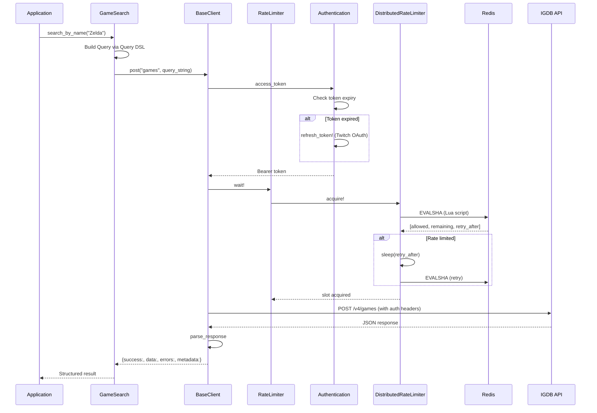

# IGDB API Wrapper

## Overview

The IGDB (Internet Game Database) API wrapper provides a Ruby client for fetching game data from IGDB's REST API. It handles authentication via Twitch OAuth2, rate limiting, and provides a fluent query builder for IGDB's Apicalypse query language.

The wrapper follows the same architecture as `Music::Musicbrainz`, using a layered approach: Configuration → Authentication → BaseClient → Search classes.

## Architecture

### Component Layers

```
┌─────────────────────────────────────────────────────────────────┐
│                      Search Classes                              │
│  GameSearch, CompanySearch, PlatformSearch, GenreSearch, etc.   │
├─────────────────────────────────────────────────────────────────┤
│                        BaseClient                                │
│        HTTP layer (POST requests, auth headers, response)        │
├─────────────────────────────────────────────────────────────────┤
│  Query Builder  │  Rate Limiter  │  Authentication              │
│  (Apicalypse)   │  (4 req/sec)   │  (Twitch OAuth2)             │
├─────────────────────────────────────────────────────────────────┤
│                      Configuration                               │
│           Environment variables, timeouts, URLs                  │
└─────────────────────────────────────────────────────────────────┘
```

### Request Flow



## Key Files

> All file paths below are relative to the `web-app/` directory.

### Core Classes

| File | Purpose |
|------|---------|
| `app/lib/games/igdb/configuration.rb` | Environment variables, API URLs, timeouts. Validates required credentials on initialization |
| `app/lib/games/igdb/authentication.rb` | Twitch OAuth2 client credentials flow. Thread-safe token caching with auto-refresh 5 min before expiry |
| `app/lib/games/igdb/base_client.rb` | HTTP layer using Faraday. Sends POST requests with auth headers, handles 401 retry and 429 rate limit backoff |
| `app/lib/games/igdb/query.rb` | Immutable builder for Apicalypse query syntax. Supports fields, where, search, sort, limit, offset |
| `app/lib/games/igdb/rate_limiter.rb` | IGDB-specific rate limiter (4 req/sec) that delegates to `DistributedRateLimiter` |
| `app/lib/games/igdb/exceptions.rb` | Exception hierarchy: ConfigurationError, AuthenticationError, NetworkError, HttpError variants, ParseError, QueryError |

### Search Classes

| File | Purpose |
|------|---------|
| `app/lib/games/igdb/search/base_search.rb` | Abstract base with `find_by_id`, `find_by_ids`, `search`, `where`, `all`, `count` methods |
| `app/lib/games/igdb/search/game_search.rb` | Games endpoint. Additional methods: `search_by_name`, `find_with_details`, `by_platform` |
| `app/lib/games/igdb/search/company_search.rb` | Companies endpoint. Additional: `search_by_name`, `find_with_details` |
| `app/lib/games/igdb/search/platform_search.rb` | Platforms endpoint. Additional: `search_by_name`, `by_family` |
| `app/lib/games/igdb/search/cover_search.rb` | Covers endpoint. Additional: `find_by_game_id`, `find_by_game_ids`, `image_url` |
| `app/lib/games/igdb/search/genre_search.rb` | Genres endpoint (simple entity) |
| `app/lib/games/igdb/search/franchise_search.rb` | Franchises endpoint (simple entity) |
| `app/lib/games/igdb/search/game_mode_search.rb` | Game modes endpoint (simple entity) |
| `app/lib/games/igdb/search/theme_search.rb` | Themes endpoint (simple entity) |
| `app/lib/games/igdb/search/keyword_search.rb` | Keywords endpoint (simple entity) |
| `app/lib/games/igdb/search/player_perspective_search.rb` | Player perspectives endpoint (simple entity) |

### Distributed Rate Limiter

| File | Purpose |
|------|---------|
| `app/lib/distributed_rate_limiter.rb` | Generic Redis-backed rate limiter using sliding window algorithm. Atomic Lua scripts prevent race conditions across processes |
| `config/initializers/redis.rb` | Creates `REDIS_POOL` connection pool for shared rate limiting |

### Tests

| File | Purpose |
|------|---------|
| `test/lib/games/igdb/configuration_test.rb` | Configuration validation tests |
| `test/lib/games/igdb/authentication_test.rb` | OAuth token management tests |
| `test/lib/games/igdb/base_client_test.rb` | HTTP layer, error handling, retry logic tests |
| `test/lib/games/igdb/query_test.rb` | Query builder DSL tests |
| `test/lib/games/igdb/rate_limiter_test.rb` | Rate limiter delegation tests |
| `test/lib/games/igdb/search/*_test.rb` | Search class tests (one per search class) |
| `test/lib/distributed_rate_limiter_test.rb` | Distributed rate limiter tests |

## Configuration

### Environment Variables

| Variable | Required | Default | Description |
|----------|----------|---------|-------------|
| `TWITCH_API_CLIENT_ID` | Yes | — | Twitch application client ID (from Twitch Developer Console) |
| `TWITCH_API_CLIENT_SECRET` | Yes | — | Twitch application client secret |
| `IGDB_API_URL` | No | `https://api.igdb.com/v4` | IGDB API base URL |
| `TWITCH_AUTH_URL` | No | `https://id.twitch.tv/oauth2/token` | Twitch OAuth token endpoint |
| `REDIS_URL` | No | `redis://localhost:6379/0` | Redis URL for distributed rate limiting |

### Configuration Options

```ruby
config = Games::Igdb::Configuration.new
config.timeout = 30        # Request timeout (seconds)
config.open_timeout = 10   # Connection timeout (seconds)
config.max_retries = 3     # Max retries on 429 rate limit
config.user_agent = "My App/1.0"
```

## Usage Examples

### Basic Search

```ruby
# Search for games by name
search = Games::Igdb::Search::GameSearch.new
result = search.search_by_name("The Legend of Zelda: Breath of the Wild")

if result[:success]
  result[:data].each do |game|
    puts "#{game['name']} (IGDB ID: #{game['id']})"
  end
end
```

### Find by ID with Details

```ruby
# Get full game details with related entities
search = Games::Igdb::Search::GameSearch.new
result = search.find_with_details(7346)  # Zelda: BotW IGDB ID

game = result[:data].first
puts game['name']
puts "Genres: #{game['genres'].map { |g| g['name'] }.join(', ')}"
puts "Platforms: #{game['platforms'].map { |p| p['name'] }.join(', ')}"
```

### Query Builder DSL

```ruby
# Build complex queries with the fluent DSL
query = Games::Igdb::Query.new
  .fields(:name, :rating, :first_release_date)
  .where("rating > 85")
  .where(platforms: [48, 49])  # PS4, Xbox One
  .sort(:rating, :desc)
  .limit(25)
  .to_s

# Produces: "fields name, rating, first_release_date; where rating > 85 & platforms = (48,49); sort rating desc; limit 25;"
```

### Cover Image URLs

```ruby
cover_search = Games::Igdb::Search::CoverSearch.new
result = cover_search.find_by_game_id(7346)

cover = result[:data].first
url = cover_search.image_url(cover['image_id'], size: CoverSearch::SIZE_COVER_BIG)
# => "https://images.igdb.com/igdb/image/upload/t_cover_big/co1abc.jpg"
```

### Custom Fields and Pagination

```ruby
search = Games::Igdb::Search::PlatformSearch.new
result = search.all(
  fields: [:name, :abbreviation, :generation],
  limit: 50,
  offset: 100,
  sort: [:generation, :desc]
)
```

## Exception Handling

### Exception Hierarchy

```
Games::Igdb::Exceptions::Error < StandardError
├── ConfigurationError      # Missing/invalid env vars
├── AuthenticationError     # Twitch OAuth failures
├── NetworkError            # Connection failures
│   └── TimeoutError        # Request timeout
├── HttpError               # HTTP error responses
│   ├── ClientError (4xx)
│   │   ├── BadRequestError (400)
│   │   ├── UnauthorizedError (401)
│   │   ├── NotFoundError (404)
│   │   └── RateLimitError (429)
│   └── ServerError (5xx)
├── ParseError              # JSON parse failures
└── QueryError              # Invalid query construction
```

### Handling Errors

```ruby
search = Games::Igdb::Search::GameSearch.new

begin
  result = search.find_by_id(999999999)
rescue Games::Igdb::Exceptions::NotFoundError => e
  puts "Game not found: #{e.message}"
rescue Games::Igdb::Exceptions::RateLimitError => e
  puts "Rate limited after retries: #{e.message}"
rescue Games::Igdb::Exceptions::NetworkError => e
  puts "Network error: #{e.message}"
end
```

## Rate Limiting

### IGDB Limits

IGDB enforces **4 requests per second** for standard API access. The wrapper handles this automatically:

1. **Pre-request throttling**: `RateLimiter` calls `DistributedRateLimiter.acquire!` before each request
2. **429 retry**: On HTTP 429, exponential backoff (1s, 2s, 4s) up to `max_retries`
3. **Distributed coordination**: Redis-backed sliding window ensures rate limit is respected across all processes

### Distributed Rate Limiter

The `DistributedRateLimiter` class provides Redis-backed rate limiting:

```ruby
limiter = DistributedRateLimiter.new(
  key: "igdb:api",
  limit: 4,
  window: 1.0,        # 1 second window
  mode: :blocking     # :blocking or :immediate
)

# Blocking mode: sleeps until slot available
limiter.acquire!

# Immediate mode: raises RateLimitExceeded if no slot
limiter = DistributedRateLimiter.new(key: "api", limit: 4, window: 1.0, mode: :immediate)
limiter.acquire!  # => raises DistributedRateLimiter::RateLimitExceeded
```

### Redis Lua Script

The rate limiter uses an atomic Lua script for race-condition-free operation:

- Uses Redis server time (avoids clock skew across nodes)
- Sliding window algorithm with sorted set
- Returns: `[allowed, remaining, retry_after_ms]`

## Authentication

### Twitch OAuth2 Flow

IGDB uses Twitch accounts for API access. Authentication uses client credentials grant:

1. `POST https://id.twitch.tv/oauth2/token?client_id=X&client_secret=Y&grant_type=client_credentials`
2. Response: `{"access_token": "abc", "expires_in": 5587808, "token_type": "bearer"}`
3. Token cached in-memory, auto-refreshed when within 5 minutes of expiry

### Thread Safety

The `Authentication` class uses a `Mutex` to prevent concurrent token refresh:

```ruby
def access_token
  @mutex.synchronize do
    perform_refresh! if token_expired?
    @access_token
  end
end
```

## Apicalypse Query Syntax

IGDB uses the Apicalypse query language instead of URL parameters:

| Query Clause | Example |
|--------------|---------|
| `fields` | `fields name, rating;` |
| `fields *` | `fields *;` (all fields) |
| `exclude` | `exclude storyline;` |
| `where` | `where rating > 75 & platforms = (48,49);` |
| `search` | `search "zelda";` |
| `sort` | `sort rating desc;` |
| `limit` | `limit 50;` |
| `offset` | `offset 100;` |

The `Query` class builds these strings from Ruby method calls:

```ruby
Query.new
  .fields(:name, :rating)
  .where("rating > 75")
  .where(platforms: [48, 49])  # Hash syntax for equality/IN
  .sort(:rating, :desc)
  .limit(25)
  .to_s
```

### Search Term Escaping

User-provided search terms are automatically escaped:
- Backslashes: `\` → `\\\\`
- Quotes: `"` → `\"`

## Key Patterns

### Immutable Query Builder

The `Query` class is immutable - each method returns a new instance:

```ruby
q1 = Query.new
q2 = q1.fields(:name)     # q1 unchanged
q3 = q2.limit(10)         # q2 unchanged

q1.to_s  # raises QueryError (empty)
q2.to_s  # "fields name;"
q3.to_s  # "fields name; limit 10;"
```

### Structured Response Format

All search methods return a consistent hash structure:

```ruby
{
  success: true,
  data: [{"id" => 7346, "name" => "Zelda..."}],
  errors: [],
  metadata: {
    endpoint: "games",
    query: "search \"zelda\"; fields name; limit 10;",
    response_time: 0.234,
    status_code: 200
  }
}
```

### Error Response Format

On errors, the response includes error details:

```ruby
{
  success: false,
  data: nil,
  errors: ["Not found"],
  metadata: {
    endpoint: "games",
    query: "where id = 999999;",
    error_type: "Games::Igdb::Exceptions::NotFoundError"
  }
}
```

### BaseSearch Template Methods

Search classes inherit from `BaseSearch` and override:

```ruby
class MySearch < BaseSearch
  def endpoint
    "my_endpoint"  # Required
  end

  def default_fields
    %w[name slug]  # Required
  end
end
```

## Image Size Constants

The `CoverSearch` class provides constants for IGDB image sizes:

| Constant | IGDB Size | Dimensions |
|----------|-----------|------------|
| `SIZE_THUMB` | `t_thumb` | 90×90 |
| `SIZE_COVER_SMALL` | `t_cover_small` | 90×128 |
| `SIZE_COVER_BIG` | `t_cover_big` | 264×374 |
| `SIZE_720P` | `t_720p` | 1280×720 |
| `SIZE_1080P` | `t_1080p` | 1920×1080 |

## Testing

Tests use Minitest + Mocha with stubbed HTTP calls:

```ruby
test "search returns games" do
  mock_response = OpenStruct.new(status: 200, body: '[{"id": 1, "name": "Test"}]')
  mock_connection = mock("connection")
  mock_connection.expects(:post).returns(mock_response)
  @client.instance_variable_set(:@connection, mock_connection)

  result = @client.post("games", "fields name;")
  assert result[:success]
end
```

The distributed rate limiter tests use a `MockRedisPool` wrapper to avoid Mocha `yields` issues with connection pools.

## Related Documentation

- [Data Importers](data_importers.md) - Import workflows that consume this wrapper
- [Distributed Rate Limiter Spec](../specs/completed/distributed-rate-limiter.md) - Detailed rate limiter design
- [IGDB API Wrapper Spec](../specs/completed/games-igdb-api-wrapper.md) - Original implementation spec
- [IGDB API Docs](https://api-docs.igdb.com/) - Official IGDB documentation
- [Apicalypse Syntax](https://apicalypse.io/syntax/) - Query language reference

## Future Enhancements

- Protobuf support for higher performance (`POST /v4/games.pb`)
- Multi-query endpoint (`POST /v4/multiquery`) for batching
- Screenshot and video search classes
- Data importer providers that consume this wrapper
