# List Wizard User Guide

This guide walks you through the full process of adding a list and using the List Wizard to import items. It covers Song lists, Album lists, and Game lists.

---

## Table of Contents

- [Overview](#overview)
- [Part 1: Creating a New List](#part-1-creating-a-new-list)
  - [Navigating to Lists](#navigating-to-lists)
  - [Filling Out the List Form](#filling-out-the-list-form)
  - [Understanding List Fields](#understanding-list-fields)
- [Part 2: Launching the List Wizard](#part-2-launching-the-list-wizard)
- [Part 3: The Wizard Steps](#part-3-the-wizard-steps)
  - [Step 1: Import Source (Songs & Albums only)](#step-1-import-source-songs--albums-only)
  - [Step 2: Parse HTML](#step-2-parse-html)
  - [Step 3: Enrich Data](#step-3-enrich-data)
  - [Step 4: Validate Matches](#step-4-validate-matches)
  - [Step 5: Review](#step-5-review)
  - [Step 6: Import](#step-6-import)
  - [Step 7: Complete](#step-7-complete)
- [Domain-Specific Notes](#domain-specific-notes)
  - [Song Lists](#song-lists)
  - [Album Lists](#album-lists)
  - [Game Lists](#game-lists)
- [Tips and Troubleshooting](#tips-and-troubleshooting)

---

## Overview

The List Wizard is a step-by-step tool that takes a ranked list (for example, "Rolling Stone's 500 Greatest Songs of All Time") and imports all the items into our system. The wizard handles:

1. **Parsing** the raw HTML or text from the original source into individual items
2. **Enriching** each item by searching our database and external sources (MusicBrainz for songs/albums, IGDB for games) to find matches
3. **Validating** the matches using AI to catch errors
4. **Reviewing** the results so you can fix any problems manually
5. **Importing** the final matched items into the database

The entire process typically takes 5-15 minutes depending on the size of the list.

---

## Part 1: Creating a New List

### Navigating to Lists

1. Log into the admin panel
2. Navigate to the appropriate section:
   - **Song lists**: Go to Songs > Lists
   - **Album lists**: Go to Albums > Lists
   - **Game lists**: Go to Games > Lists
3. You will see a table of existing lists with their names, status, year, and item counts

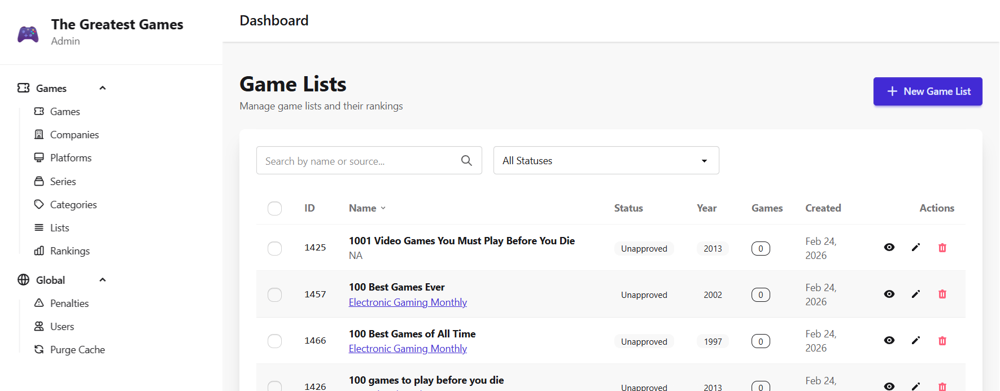

4. Click the **"New [Song/Album/Game] List"** button in the top-right corner

### Filling Out the List Form

The form is organized into sections (cards). Here is what each section contains:

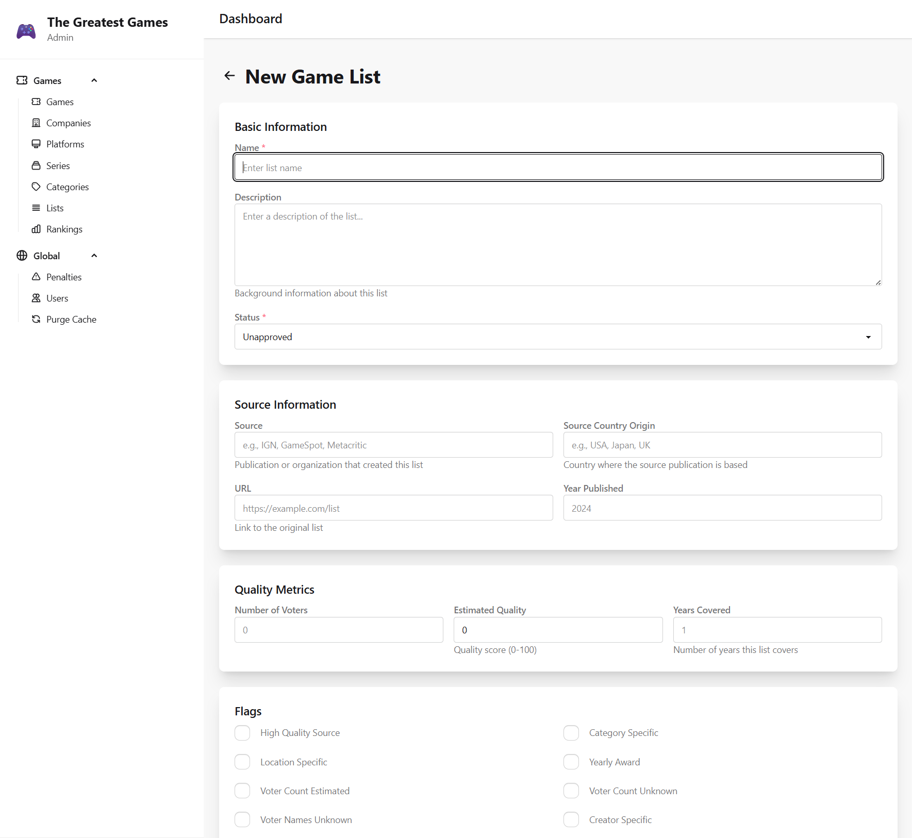

### Understanding List Fields

#### Basic Information (Required)

| Field | What to enter |
|-------|--------------|
| **Name** | The title of the list exactly as it appears on the source. Example: "Rolling Stone's 500 Greatest Songs of All Time" |
| **Description** | Any useful background info about this list. For example: "Updated 2021 version. Voted on by artists, journalists, and industry figures." This is optional but helpful. |
| **Status** | Always set to **"Unapproved"** when creating a new list. Other statuses (Approved, Active, Rejected) will be set later by an admin. |

#### Source Information

| Field | What to enter |
|-------|--------------|
| **Source** | The publication or website the list comes from. Examples: "Rolling Stone", "NME", "IGN", "Metacritic" |
| **Source Country Origin** | The country where the source is based. Examples: "United States", "United Kingdom" |
| **URL** | The full web address of the original list. Must start with `https://`. Example: `https://www.rollingstone.com/music/music-lists/best-songs-of-all-time-1224767/` |
| **Year Published** | The year this specific version of the list was published. Example: `2021` |
| **MusicBrainz Series ID** | *(Album lists only)* A special identifier from MusicBrainz. You will only need this if specifically instructed. It looks like: `12345678-1234-1234-1234-123456789012` |

#### Quality Metrics

These fields help us track the credibility and scope of each list. Fill in what you know; leave blank if unsure.

| Field | What to enter |
|-------|--------------|
| **Number of Voters** | How many people voted or contributed to creating this list. Example: `300`. If the list was clearly made by a group (like an editorial team) but the exact number is not published, make a conservative estimate and check the **"Voter Count Estimated"** flag. For example, if a magazine's editorial staff created the list, you might estimate `10`-`20`. Leave blank only if it was created by a single author. |
| **Estimated Quality** | A score from 0 to 100 representing how reliable/authoritative this list is. Ask your admin if unsure what to put here. |
| **Years Covered** | How many years of content this list spans. Example: A "Best of 2024" list covers `1` year. A "Greatest of All Time" list might cover `50` or more years. |

#### Flags

Check any flags that apply to this list. If you are unsure about a flag, leave it unchecked.

| Flag | When to check it |
|------|-----------------|
| **High Quality Source** | The source is a well-known, reputable publication (e.g., Rolling Stone, NME, Pitchfork, IGN) |
| **Category Specific** | The list is limited to a specific genre or category (e.g., "Best Hip-Hop Albums" rather than "Best Albums") |
| **Location Specific** | The list focuses on a specific country or region (e.g., "Best British Rock Bands") |
| **Yearly Award** | The list is a recurring award ceremony or organization (e.g., "Grammy Award Winners", "Oscar Winners", "BAFTA Best Game") |
| **Voter Count Estimated** | Check this if the Number of Voters field is an estimate rather than an exact count |
| **Voter Count Unknown** | Check this if you have no idea how many people voted |
| **Voter Names Unknown** | Check this if the individual voters or judges are not publicly listed |
| **Creator Specific** | The list is focused on the works of a specific creator (artist, band, studio, franchise). Examples: "Best Radiohead Songs", "Best Fallout Games", "Best Depeche Mode Albums" |

#### Data Import

These fields are where you paste the raw content from the source website. The wizard also lets you paste HTML later, so you can fill these in now or wait until the wizard step.

| Field | What to enter |
|-------|--------------|
| **Raw Content** | Paste the HTML or plain text directly from the source webpage. To get the HTML: go to the source page, select the list content, right-click and choose "Inspect" or "View Source", and copy the relevant HTML. You can also just copy-paste the visible text. |
| **Simplified Content** | This is automatically generated when you save the list. It strips out images, scripts, and other unnecessary code from the Raw Content, leaving just the text. You can manually edit this to clean it up if needed. |

> **Note**: The "Items JSON" field (if visible) is read-only and shows data generated by AI parsing. You do not need to fill this in.

After filling out the form, click the **"Create [Song/Album/Game] List"** button at the bottom.

---

## Part 2: Launching the List Wizard

After creating the list, you will be taken to the **list detail page**. This page shows all the information you just entered.

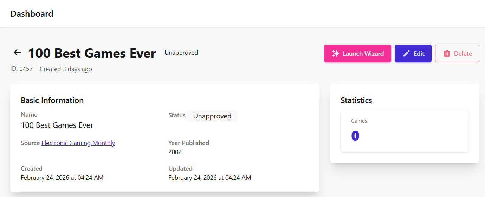

1. Find the **"Launch Wizard"** button near the top-right of the page (it is a blue button with a sparkle icon)
2. Click it to start the wizard
3. If you previously started the wizard and did not finish, you will see a yellow **"In Progress"** badge on the button. Clicking it will resume where you left off.

---

## Part 3: The Wizard Steps

The wizard has 7 steps. A progress bar at the top shows which step you are on.

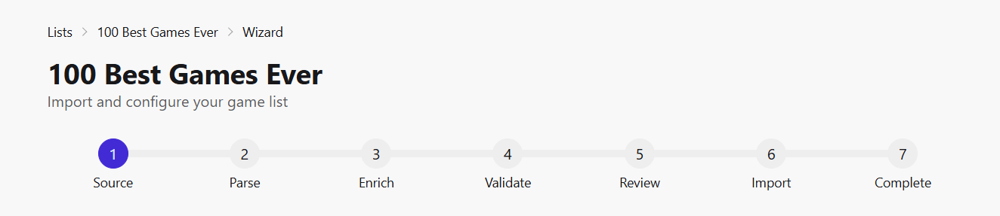

### Step 1: Import Source (Songs & Albums only)

> **Game lists skip this step** and go directly to Step 2 (Parse HTML).

This step lets you choose how to import the list data.

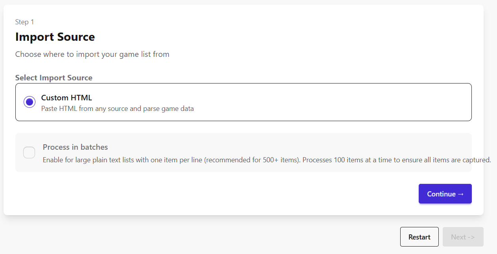

**Options:**
- **Custom HTML** (most common) — You will paste HTML from the source website in the next step
- **MusicBrainz Series** (songs only) — Import directly from a MusicBrainz series. This requires a MusicBrainz Series ID to be set on the list. If available, this option skips ahead to the Review step since MusicBrainz provides structured data directly.

**Batch Processing checkbox:**
If your list has 500 or more items and is a plain text list (one item per line), check the **"Process in batches"** box. This breaks the list into groups of 100 for more reliable processing. Do **not** check this for HTML lists with complex formatting.

Click **"Continue"** to proceed.

### Step 2: Parse HTML

This step extracts individual items (songs, albums, or games) from the raw HTML or text you provide.

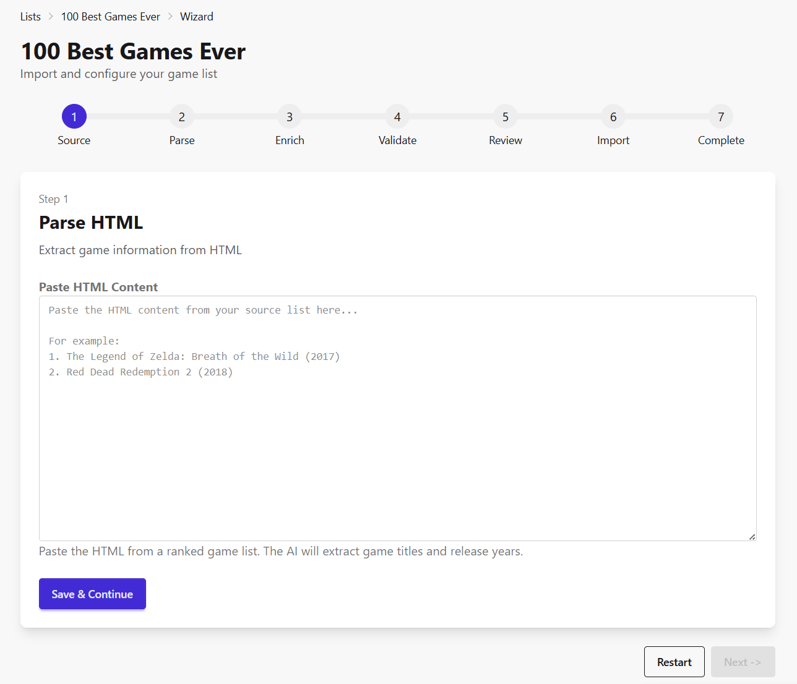

**If no HTML has been saved yet:**
1. Go to the source webpage in your browser
2. Select the list content on the page
3. Right-click and copy the HTML (or just copy the visible text)
4. Paste it into the large text box in the wizard
5. Click **"Save & Continue"**

**After HTML is saved:**

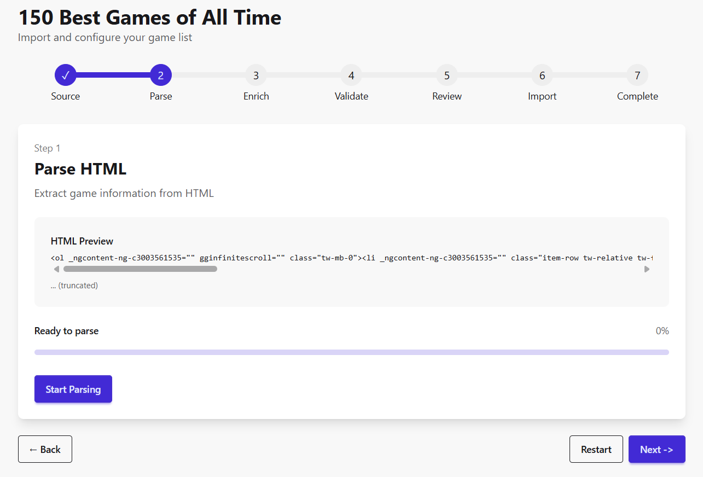

1. You will see a preview of the saved HTML
2. Click **"Start Parsing"** to begin
3. A progress bar will appear while the AI extracts the items
4. When complete, you will see a **"Parsing Complete!"** message with the number of items found
5. A table below shows all parsed items with their position number, title, and artist/year info

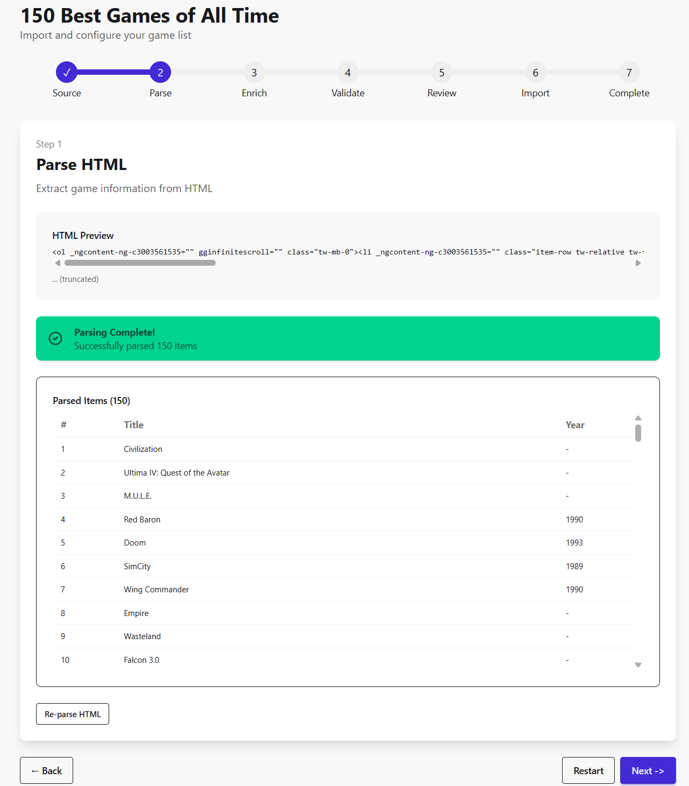

Review the parsed items to make sure they look correct. If something looks wrong, you can click **"Re-parse HTML"** to try again, or go back and edit the HTML.

Click **"Next"** to continue.

### Step 3: Enrich Data

This step searches for each item in our database and external sources to find matches.

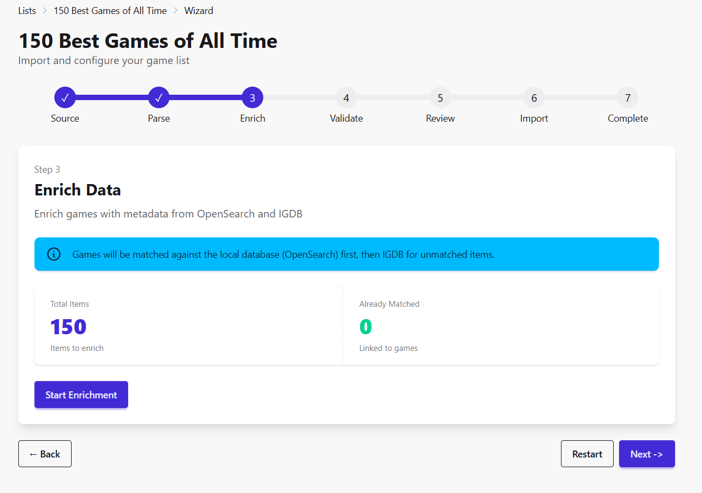

1. You will see how many items need to be enriched
2. Click **"Start Enrichment"**
3. A progress bar shows the enrichment running through each item
4. The system first searches our local database (OpenSearch), then falls back to external sources:
   - **Songs/Albums**: MusicBrainz
   - **Games**: IGDB (Internet Game Database)

5. When complete, you will see a summary showing:
   - How many items were found in our database (OpenSearch Matches)
   - How many were found via the external source (IGDB/MusicBrainz Matches)
   - How many could not be found (Not Found)
   - A table of all enriched items with their match source and status

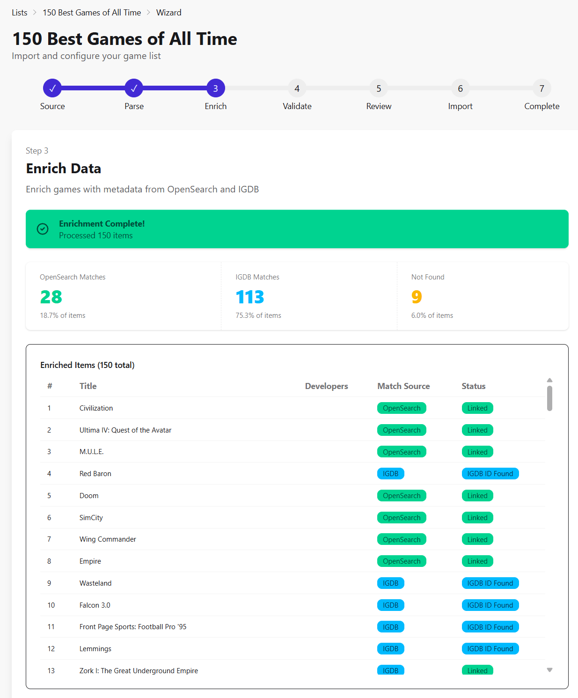

Click **"Next"** to continue.

### Step 4: Validate Matches

This step uses AI to check whether the matches from the enrichment step are correct. For example, it catches cases where a live version was matched instead of the studio version, or where a cover was matched instead of the original.

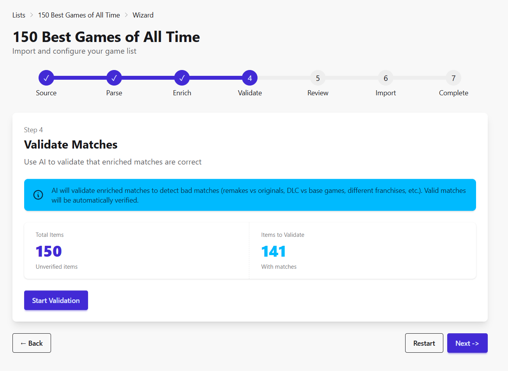

1. Click **"Start Validation"**
2. A progress bar will appear while the AI processes each item. This may take a minute for large lists.


3. When complete, you will see:
   - **Valid Matches**: Confirmed correct (automatically marked as verified)
   - **Invalid Matches**: The AI flagged these as potentially wrong
   - **AI Analysis**: A summary of what the AI checked for
   - **Validation Results** table showing each item's original title, matched title, source, and status

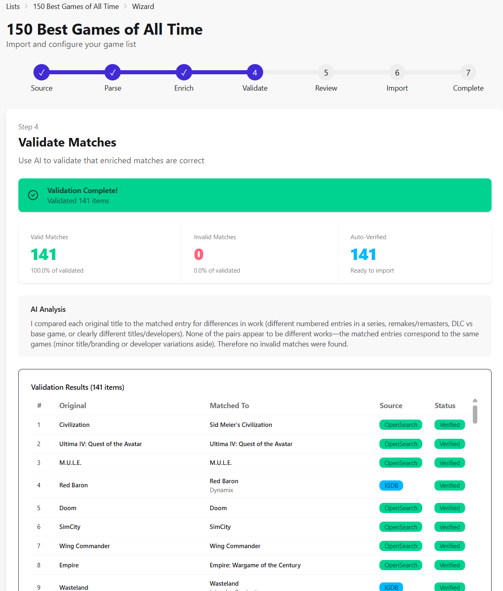

Click **"Next"** to continue to the review step where you can fix any issues.

### Step 5: Review

This is the most important manual step. Here you review all items and fix any problems.

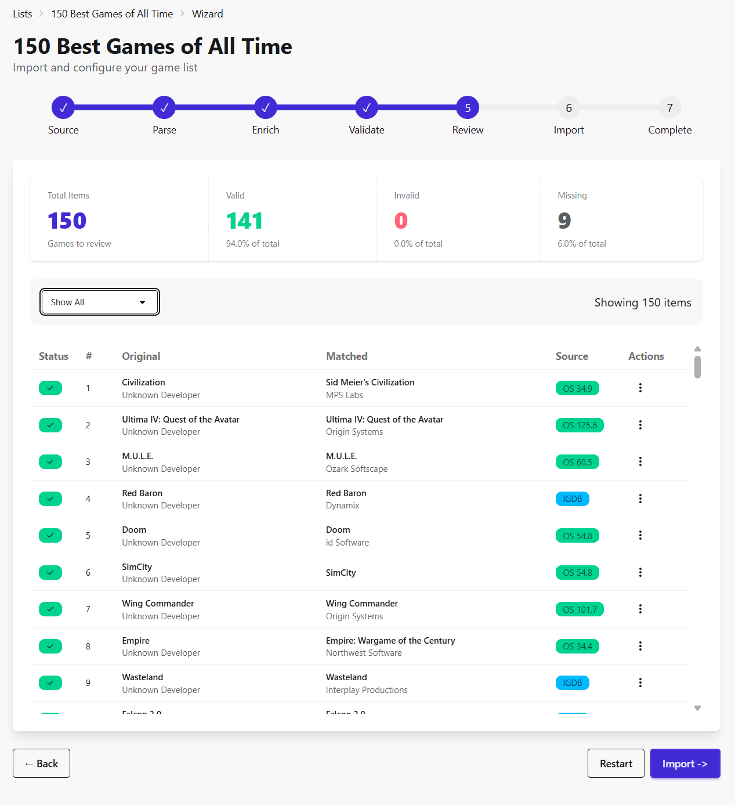

**What you see:**
- **Stats cards** at the top: Total items, Valid (green), Invalid (red), Missing (gray)
- **Filter dropdown**: Filter to show only "Valid", "Invalid", or "Missing" items
- **Review table** with columns:
  - **Status**: Badge showing valid/invalid/missing
  - **#**: The item's position in the list
  - **Original**: The title and artist/developer as parsed from the source
  - **Matched**: The song/album/game we matched it to in our database
  - **Source**: Where the match came from (OpenSearch = our database, MusicBrainz/IGDB = external)
  - **Actions**: A dropdown menu with actions you can take

**How to use the filter:**
- Start by filtering to **"Invalid"** items and fix those first
- Then check **"Missing"** items (ones with no match at all)
- Valid items usually do not need attention, but you can spot-check a few

**Actions available for each item:**

| Action | What it does |
|--------|-------------|
| **Verify** | Marks the item as correct. Use this when you have confirmed the match is right. |
| **Edit Metadata** | Opens a dialog where you can manually edit the raw data (title, artist, etc.). Use this to fix typos or incorrect information. |
| **Link Existing [Song/Album/Game]** | Search our database and manually link this item to the correct entity. Use this when the automatic matching found the wrong one. |
| **Search MusicBrainz** (songs/albums) | Search MusicBrainz to find the correct recording/release/artist. |
| **Search IGDB** (games) | Search IGDB to find the correct game. |
| **Delete** | Permanently removes this item from the list. Use this for items that should not be in the list (duplicates, errors, etc.). |


**Tips for reviewing:**
- Focus on invalid and missing items first
- For invalid items, try "Link Existing" to find the right match in our database
- If the item is not in our database at all, use the external search (MusicBrainz/IGDB) to find it
- Delete items that are clearly errors (duplicates, non-song/album/game entries, etc.)

When you are satisfied with the review, click **"Next"** to proceed to import.

### Step 6: Import

This step creates the actual database records for matched items that are not already in our system.

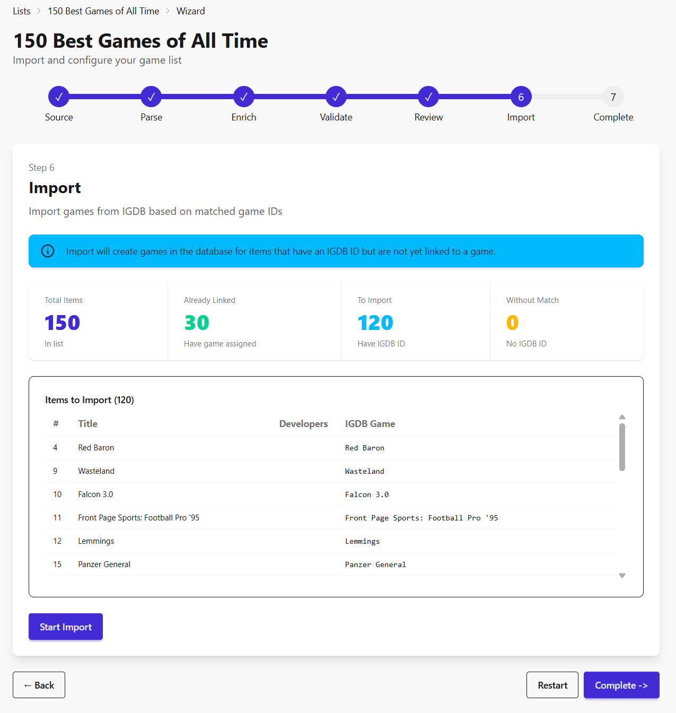

1. You will see a summary of:
   - **Total Items**: All items in the list
   - **Already Linked**: Items already connected to an existing record
   - **To Import**: Items that have a match but need to be created in our database
   - **Without Match**: Items that could not be matched (these will be skipped)
2. Click **"Start Import"**
3. Wait for the import to complete — a progress bar shows Processed, Imported, and Failed counts in real time

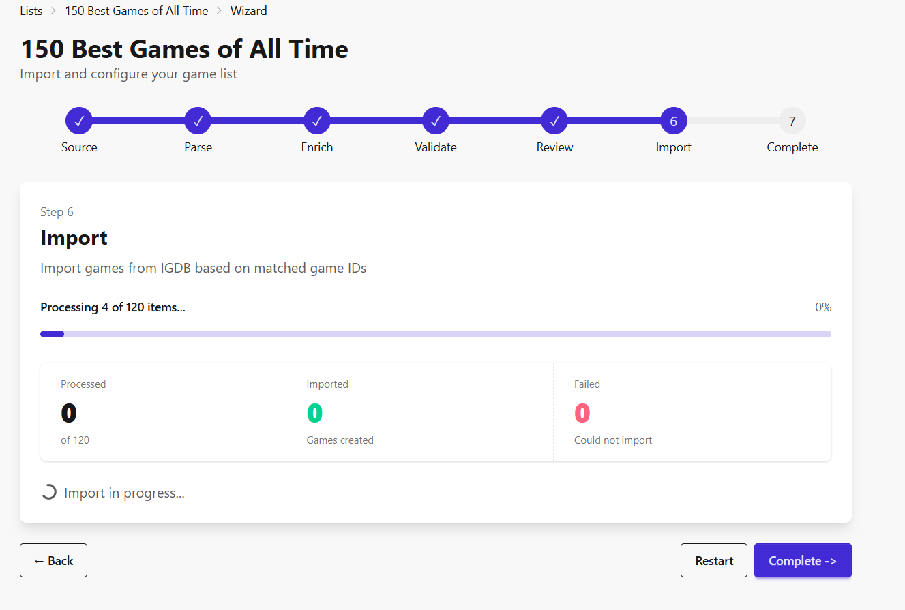

4. When done, you will see how many items were:
   - **Imported** (newly created)
   - **Skipped** (already existed)
   - **Failed** (had errors)

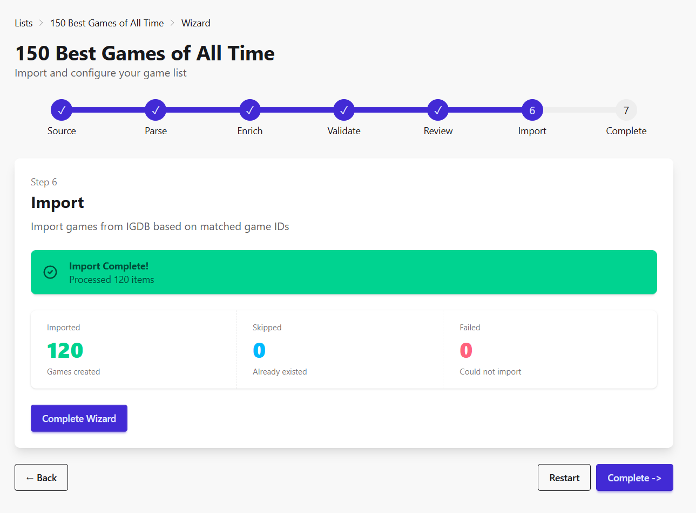

If any items failed, you can expand the "View Failed Items" section to see what went wrong. You can click **"Retry Import"** to try again for failed items.

Click **"Complete Wizard"** to finish.

### Step 7: Complete

You are done! This final screen confirms the import is complete.

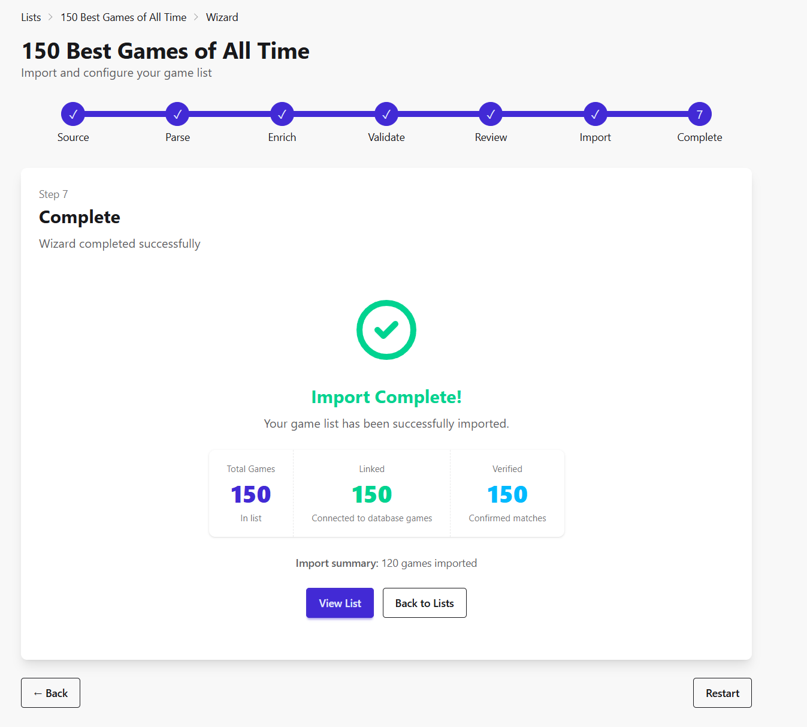

From here you can:
- Click **"View List"** to go back to the list detail page and see all imported items
- Click **"Back to Lists"** to return to the lists index

---

## Domain-Specific Notes

### Song Lists

**URL path**: Songs > Lists

**Import source options**:
- Custom HTML (paste from any website)
- MusicBrainz Series (import from a MusicBrainz series, requires MusicBrainz Series ID)

**What the parser extracts**: Song title, artist name(s), album name (if available)

**Enrichment sources**: Our local database first, then MusicBrainz

**Review step actions**:
- Verify, Edit Metadata, Delete (shared)
- Link Existing Song (search our database)
- Search MusicBrainz Recordings (search for the correct recording within a matched artist)
- Search MusicBrainz Artists (search for and replace the artist match)

**If a song does not exist in MusicBrainz**: Occasionally you will encounter a song that cannot be found in MusicBrainz. In this case, you can manually add the song through the main Songs admin area (Songs > Songs > New Song), then come back to the review step and use **"Link Existing Song"** to connect the list item to the song you just created.

### Album Lists

**URL path**: Albums > Lists

**Import source options**:
- Custom HTML (paste from any website)
- MusicBrainz Series (currently disabled/not yet implemented for albums)

**What the parser extracts**: Album title, artist name(s), release year

**Enrichment sources**: Our local database first, then MusicBrainz

**Review step actions**:
- Verify, Edit Metadata, Delete (shared)
- Link Existing Album (search our database)
- Search MusicBrainz Releases (search for the correct release within a matched artist)
- Search MusicBrainz Artists (search for and replace the artist match)

**If an album does not exist in MusicBrainz**: Occasionally you will encounter an album that cannot be found in MusicBrainz. In this case, you can manually add the album through the main Albums admin area (Albums > Albums > New Album), then come back to the review step and use **"Link Existing Album"** to connect the list item to the album you just created.

### Game Lists

**URL path**: Games > Lists

**Import source options**:
- Custom HTML only (no series import option)

**What the parser extracts**: Game title, release year

**Enrichment sources**: Our local database first, then IGDB (Internet Game Database)

**Review step actions**:
- Verify, Edit Metadata, Delete (shared)
- Link Existing Game (search our database)
- Search IGDB Games (search IGDB for the correct game)
- Link by IGDB ID (manually enter an IGDB game ID)
- Re-enrich (re-run the enrichment for a single item)
- Skip (mark item as skipped/excluded from import)

**Note**: Game lists typically only have titles (no developer info), which is fine. The system can match games by title alone.

**If a game does not exist in IGDB**: Occasionally you will encounter a game that cannot be found in IGDB at all. In this case, you can manually add the game through the main Games admin area (Games > Games > New Game), then come back to the review step and use **"Link Existing Game"** to connect the list item to the game you just created.

---

## Tips and Troubleshooting

### Formatting the list content

You can paste raw HTML directly from a website, but often the best results come from normalizing the list into a simple text format first. Use `--` to separate fields, one item per line:

**Songs:**
```
1 -- Bohemian Rhapsody -- Queen
2 -- Imagine -- John Lennon
3 -- Smells Like Teen Spirit -- Nirvana
```

**Albums:**
```
1 -- OK Computer -- Radiohead
2 -- Abbey Road -- The Beatles
3 -- Nevermind -- Nirvana
```

**Games:**
```
1 -- The Legend of Zelda: Breath of the Wild
2 -- Red Dead Redemption 2
3 -- The Witcher 3: Wild Hunt
```

For **unranked lists**, leave off the rank number:
```
Bohemian Rhapsody -- Queen
Imagine -- John Lennon
Smells Like Teen Spirit -- Nirvana
```

Raw HTML from the source website will also work, but the normalized format above tends to produce the most reliable parsing results.

### Getting good HTML from the source

- The cleaner the HTML, the better the parsing results
- If the website has a "print" or "single page" view, use that for easier copying
- For plain text lists (one item per line), just copy-paste the text directly
- If the list is very long (500+ items), consider using the **"Process in batches"** option

### What to do if parsing looks wrong

- Go back and check the HTML you pasted. Sometimes extra content (ads, sidebar items) gets included
- Try pasting just the list portion, not the entire page
- You can click **"Re-parse HTML"** to try again after fixing the input

### What to do if many items are missing matches

- This is normal for obscure or very old items
- During the Review step, use the search actions to manually find matches
- Items without matches will be skipped during import — you can always add them manually later

### What if the wizard gets stuck

- If a step seems frozen, try refreshing the page. The wizard saves progress automatically, so you will not lose your work
- You can always close the wizard and come back later by clicking **"Launch Wizard"** on the list detail page — it will resume where you left off
- If a step has failed, you will see an error message with a **"Retry"** button

### Handling combined entries (e.g., "Pokemon Red & Blue")

Some lists combine multiple items into a single entry, such as "Pokemon Red & Blue" or "Grand Theft Auto III / Vice City". These need to be split into separate items — each game (or song/album) should have its own list item.

**How to handle this:**
1. During the **Review** step, find the combined entry
2. Note the rank number of the combined entry
3. **Delete** the combined entry
4. After the wizard is complete, go to the list detail page
5. Manually add each item separately using the **"Add Game"** (or "Add Song" / "Add Album") button
6. Give each item the **same rank** as the original combined entry

This is important because our system tracks items individually, and combined entries will not match correctly during enrichment.

### Adding items after the wizard is complete

The wizard does not have to be the end of the process. You can always go back to the list detail page and manually add, edit, or remove items at any time using the **"Add [Song/Album/Game]"** button. This is useful for:
- Adding items that were missing matches and skipped during import
- Splitting combined entries (as described above)
- Adding items that were not in the original source but should be included
- Fixing any issues you notice after the wizard is done

### What if I need to start over

- Each step has a **"Back"** button to go to the previous step
- There is a **"Restart"** option to reset the wizard completely and start from the beginning
- Restarting will delete all parsed items and start fresh
