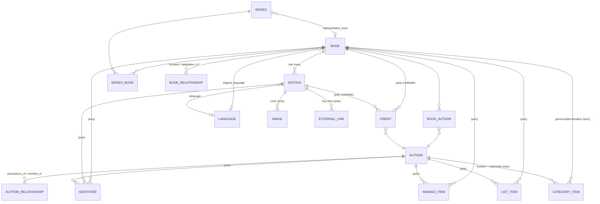

# Books Object Model — Design (v2)

## Status
- **Status**: Not Started (design approved; implementation plan pending)
- **Priority**: High
- **Created**: 2026-06-29
- **Developer**: Shane Sherman

## 1. Overview

Design the ground-up bibliographic object model for the **books** domain of The Greatest
(the rewrite of thegreatestbooks.org), fixing the structural problems catalogued in the legacy
`object-model.md` (§6 issues, §7 modeling gaps). The model reuses the new app's existing shared
infrastructure (polymorphic `Identifier`, `ExternalLink`, `Image`, `Category`, `List`,
`RankingConfiguration`, `Penalty`, `AiChat`, `SearchIndexable`) and mirrors the established
**music** domain patterns (`Album`→`Release`, `Artist`, `AlbumArtist`, `Credit`,
`SongRelationship`).

**This spec covers the domain model only** — entities, columns, enums, associations, and how each
resolves a known legacy pain point. Importers, the de-duplication/merge pipeline, hostname routing,
and public UI are explicitly **out of scope / deferred** (see §12).

## 2. Scope

**In scope (this spec):**
- Core entities: `Books::Book` (Work), `Books::Edition` (Manifestation), `Books::Author`,
  `Books::Series`.
- Join/relationship models: `Books::BookAuthor`, `Books::Credit`, `Books::AuthorRelationship`,
  `Books::SeriesBook`, `Books::BookRelationship`.
- One new **shared** model: `Language` (global namespace).
- Reorganization of the `books_*` entries in the shared `Identifier` enum (work/edition/author
  levels).
- Wiring every entity into the existing shared polymorphic tables.
- Origin/nationality modeling via existing `location`-type Categories.

**Deferred to their own specs/todos (NOT built here):**
- De-duplication & merge: `work_key`, `merged_into_id`, `Books::BookMerge`, the import-time
  matching cascade, AI match confirmation, batch merge jobs. (§8 defines only the *identifier*
  backbone that later enables this.)
- Data importers (Goodreads / Amazon / OpenLibrary / etc.).
- Hostname routing for `dev-new.thegreatestbooks.org` (dev) and `v2.thegreatestbooks.org`
  (public beta).
- Public-facing pages, controllers, ViewComponents, admin (Avo) resources.

**Out of scope entirely:** migrating legacy data (books has lots of prior data; import scripts come
later, after this model exists).

## 3. Foundational decision — 2-tier `Book` (Work) → `Edition` (Manifestation)

The book hierarchy is **two levels**: `Books::Book` is the abstract **Work** (the ranked, listed,
searched entity), and `Books::Edition` is a published **Manifestation** that carries the ISBN. This
matches the music domain (`Album`→`Release`) and the consumer-database consensus. The library-science
**Expression** tier (full FRBR/LRM) is deliberately **not** modeled.

### Why 2-tier (research summary)

Every consumer-facing book database uses 2-tier Work→Edition and treats translations/variants as
Editions of the same Work. Only library-authority systems add an Expression tier, and the modern
library standard (BIBFRAME) deliberately dropped it.

| System | Tiers | Translation is… |
|---|---|---|
| Goodreads | Work → "book" (edition) | Edition of same Work (combined) |
| LibraryThing | Work → Edition | Edition of same Work ("same text = same work") |
| OpenLibrary | Work → Edition | Edition of same Work |
| Wikidata | Work → Edition item | Edition (`edition or translation of`) |
| BookBrainz | Work → Edition (→ Edition Group) | separate Work + relationship |
| BIBFRAME | Work → Instance → Item | separate Work + `translationOf` (Expression collapsed) |
| Full FRBR/LRM | Work → **Expression** → Manifestation → Item | new Expression of same Work |

The old site was already effectively 2-tier; its duplicate problem (§7.1) was **not** caused by a
missing tier but by (a) commerce-only, sparse editions, (b) no `edition_type` discipline so variants
leaked into duplicate Works, (c) no strong identity key, and (d) no relationship/series modeling.
This design fixes those directly.

**Selected sources** (full research retained in project history):
- OpenLibrary Work/Edition: <https://openlibrary.org/about/work_edition>,
  <https://openlibrary.org/dev/docs/api/authors>
- BookBrainz schema (Author/Work/Edition/Edition-Group/Series, author-credits, aliases, generic
  relationships & identifiers): <https://github.com/metabrainz/bookbrainz-site/blob/master/sql/schemas/bookbrainz.sql>,
  <https://bookbrainz.org/help>
- FRBR / IFLA-LRM / BIBFRAME: <https://www.loc.gov/bibframe/docs/bibframe2-model.html>,
  <https://www.ifla.org/files/assets/cataloguing/frbr-lrm/ifla-lrm-august-2017_rev201712.pdf>
- OCLC FRBR Work-Set Algorithm (work identity / clustering):
  <https://www.oclc.org/content/dam/research/activities/frbralgorithm/2009-08.pdf>
- Goodreads Librarian Manual (combining rules, series, pseudonyms, ISBN/ASIN):
  <https://help.goodreads.com/s/article/Librarian-Manual-Rules-for-combining-books>
- LibraryThing work/edition & work-to-work relationships:
  <https://wiki.librarything.com/index.php/Book_combining>,
  <https://blog.librarything.com/2011/02/librarything-gets-work-to-work-relationships/>

## 4. Entity catalog

Conventions (matching music): `extend FriendlyId` with `friendly_id :title/:name, use: [:slugged,
:finders]`; `include SearchIndexable` + `as_indexed_json` where searched; `before_validation`
title/name normalization via `Services::Text::QuoteNormalizer`; Rails 8 enum syntax
(`enum :x, {a: 0}`).

### 4.1 `Books::Book` — the Work (ranked / listed / searched)

| Column | Type | Notes |
|---|---|---|
| `title` | string | required |
| `subtitle` | string | nullable |
| `sort_title` | string | normalized for sorting ("Hobbit, The") |
| `alternate_titles` | string[] | GIN-indexed. Variant/alternate title strings with **no** edition/ISBN data — especially the large dataset accumulated over years of legacy dupe-merges. The Work-level home for import-matching recall, mirroring `Author.alternate_names`; indexed into search. Alt titles that *do* have their own ISBN/edition data become `Edition`s instead (§8.3) |
| `slug` | string | FriendlyId, unique |
| `description` | text | single canonical description (replaces the legacy 4-description mess, §3.1). AI/import provenance lives in `AiChat` + `ExternalLink`, not extra columns |
| `first_published_year` | integer | nullable; the Work's original year |
| `original_language_id` | bigint FK | → `languages` (global model, §4.5), nullable |
| `book_kind` | integer enum | `standalone: 0` (default), `collection: 1` — see §6 |
| `default_edition_id` | bigint FK | nullable → `editions`; canonical edition for cover/buy-links. Prefer a complete edition (`volume_number IS NULL`) |

**Associations:** `has_many :editions`; `has_many :book_authors` (ordered) / `:authors, through`;
`has_many :credits, as: :creditable`; `has_many :series_books` / `:series, through`;
`has_many :book_relationships` (+ inverse); `belongs_to :original_language` (optional);
`belongs_to :default_edition` (optional). Shared polymorphics: `identifiers`, `images` (+
`primary_image`), `external_links`, `category_items`/`categories`, `list_items`/`lists`,
`user_list_items`/`user_lists`, `ranked_items`, `ai_chats`.

**Genre / subject / origin:** via the existing `Books::Category` system (not columns). Origin
(nationality) uses `location`-type categories (§9).

**Scopes:** `selectable` (= `where(book_kind: :standalone)`) — used by list-building autocomplete and
user-facing discovery so `collection` books stay matchable by importers but hidden from selection.

**Validations:** `title` presence. **Ranked & listable.**

### 4.2 `Books::Edition` — the Manifestation (ISBN lives here)

| Column | Type | Notes |
|---|---|---|
| `book_id` | bigint FK | → `books`, **required** (`belongs_to` exactly one; omnibus is a container Book, §6) |
| `title` | string | nullable; differs for translations/variants ("The Fellowship of the Ring") |
| `subtitle` | string | nullable |
| `edition_type` | integer enum | `standard: 0, annotated: 1, illustrated: 2, critical: 3, abridged: 4, revised: 5` — the §7.3 fix (variants are Editions, not dup Works) |
| `language_id` | bigint FK | → `languages`; **a translation is an Edition with a different language** + a `translator` Credit (§7.6 fix) |
| `binding` | integer enum | `hardcover, paperback, mass_market, ebook, audiobook, library_binding, leather_bound, other` |
| `publication_year` | integer | nullable |
| `volume_number` | integer | nullable; set on volume-split editions; `null` = complete edition (§6, Scenario 2) |
| `page_count` | integer | nullable |
| `popularity` | integer | nullable; signal for choosing `default_edition` |
| `metadata` | jsonb | import-source payload (mirrors `Music::Release.metadata`) |

Publisher intentionally omitted for now (no publisher data). Add a `publisher_name` string or a
`Books::Publisher` entity when importers land — both are additive.

**Associations:** `belongs_to :book`; `belongs_to :language` (optional); `has_many :credits, as:
:creditable`. Shared polymorphics: `identifiers` (ISBN/ASIN/etc.), `images` (+ `primary_image` — the
edition's cover), `external_links` (format-specific buy links: Amazon/Bookshop), `ai_chats`.
**Not** listable, **not** ranked, **not** categorized (those live on `Book`).

### 4.3 `Books::Author` — creative agent (role-neutral; mirrors `Music::Artist`)

Named `Author` per the consumer-DB + brand convention (BookBrainz/OpenLibrary/Goodreads all use a
broadly-defined "Author"). The **role is always on the relationship** (`BookAuthor.role`,
`Credit.role`), never on this entity — so a translator is an `Author` linked via a
`Credit(role: translator)`.

| Column | Type | Notes |
|---|---|---|
| `name` | string | required |
| `sort_name` | string | "King, Stephen" (manually settable; **no fragile Namae auto-parsing** — that was §7.5's unreliable backbone) |
| `slug` | string | FriendlyId, unique |
| `kind` | integer enum | `person: 0` (default), `organization: 1`, `pseudonym: 2`, `collective: 3` (shared persona / house name) |
| `birth_year` | integer | nullable (negative allowed for BC/ancient) |
| `death_year` | integer | nullable |
| `description` | text | bio |
| `alternate_names` | string[] | GIN-indexed; search/match recall ("W. E. B. Du Bois" ↔ "William Edward Burghardt Du Bois") without a parser |

**Nationality/origin:** `location`-type categories (§9) — **no `country` column** (handles "Roman"/
"Ancient Greek" and keeps a single origin mechanism, avoiding §6 #16 duplication).

**Associations:** `has_many :book_authors` / `:books, through`; `has_many :credits` (as the credited
author); `has_many :author_relationships` (+ inverse). Shared polymorphics: `identifiers`
(**the §6 #3 fix** — VIAF/ISNI/Wikidata/OpenLibrary/Goodreads/LibraryThing/LCNAF, replacing the lone
`wikipedia_url` column), `images` (photo), `external_links`, `category_items`/`categories`,
`ranked_items` (authors are rankable — "Greatest Authors"), `ai_chats`. **Ranked & listable.**

### 4.4 `Books::Series` — grouping/navigation (NOT ranked, NOT listed)

Rankings attach to Books/Authors, never a Series (a weak later volume must never inherit an early
volume's rank). A Series is a grouping + a resolution target for whole-series list mentions.

| Column | Type | Notes |
|---|---|---|
| `title` | string | required |
| `slug` | string | FriendlyId, unique |
| `description` | text | nullable |
| `representative_book_id` | bigint FK | nullable → `books`; **defaults to the `position` 1 member**; overridable for series whose iconic entry isn't book 1. A list mention of "the whole series" resolves here (§7) |

**Associations:** `has_many :series_books` / `:books, through`; `belongs_to :representative_book`
(optional). Shared: `identifiers`, `images`, `external_links`, `ai_chats`,
`SearchIndexable`. **Not** ranked, **not** listable.

### 4.5 `Language` — global shared model (new)

Universal lookup shared across all domains (root namespace, like `Identifier`/`Image`). Introduced
by this spec (books is the first consumer); music/movies/games can adopt it later.

| Column | Type | Notes |
|---|---|---|
| `name` | string | "French", "Ancient Greek" — required |
| `slug` | string | FriendlyId, unique |
| `iso_639_1` | string(2) | nullable ("fr") — not all languages have a 2-char code |
| `iso_639_3` | string(3) | "fra"; comprehensive incl. dead languages ("lat", "grc", "ang") |

Referenced by `Books::Book.original_language_id` and `Books::Edition.language_id`.

## 5. Join & relationship models

### 5.1 `Books::BookAuthor` — primary authorship (mirrors `Music::AlbumArtist`)
| Column | Notes |
|---|---|
| `book_id`, `author_id` | unique together |
| `position` | ordering ("Gaiman & Pratchett") |
| `role` | enum: `author: 0` (default), `editor: 1` (for "edited by" anthologies) |
| `credited_as` | nullable — the name as printed on the work (**pen-name display mechanism**) |

Authorship of the **Work** lives only here (Editions inherit it) — avoids OpenLibrary's
"authorship stored twice" bug.

### 5.2 `Books::Credit` — secondary roles (polymorphic; mirrors `Music::Credit`)
`belongs_to :author`; `belongs_to :creditable, polymorphic: true` (→ `Books::Book` **or**
`Books::Edition`); `position`.
- `role` enum: `translator, illustrator, editor, introduction, foreword, afterword, narrator,
  cover_artist, contributor, ghostwriter`.
- Edition-specific roles (translator, illustrator, narrator) attach to the `Edition`; work-level
  roles attach to the `Book`.

### 5.3 `Books::AuthorRelationship` — pen-names & personas (self-ref; mirrors `Music::Membership`)
| Column | Notes |
|---|---|
| `from_author_id`, `to_author_id` | both → `authors` |
| `relation_type` | enum: `pseudonym_of: 0` (Bachman → King), `member_of: 1` (Dannay → "Ellery Queen") |

Supports two weights (editorial judgment per author) — the §7.5 fix:
- **Heavy persona** (Bachman, Galbraith): a real `Author` row (`kind: pseudonym`) linked
  `pseudonym_of` → the person. Gets its own page/rankings, displays as the pen name, attribution
  walks the link. "All Bachman books" = `author_id = bachman` (first-class).
- **Light variant**: skip the second entity — `alternate_names` + `credited_as` on `BookAuthor`.

### 5.4 `Books::SeriesBook` — series membership
| Column | Notes |
|---|---|
| `series_id`, `book_id` | unique together (a Book may be in multiple series) |
| `position` | **decimal** — allows 1.5 for novellas/in-between entries (Goodreads pattern) |
| `position_label` | string — display ("Book One", "0.5") when it differs from the sort number |
| `numbered` | boolean — unnumbered companions attach without forcing a position |

### 5.5 `Books::BookRelationship` — Work↔Work (self-ref; mirrors `Music::SongRelationship`)
`book_id` → `related_book_id`, `relation_type` enum with inverse helper scopes:
| `relation_type` | Use |
|---|---|
| `contains` / (inverse `contained_in`) | Omnibus/collection Book → its component Books (structural side of combos) |
| `abridgement_of` | A substantial abridged version that is its own Book |
| `adaptation_of` | Graphic novel / retelling |
| `revision_of` | A substantially-rewritten new Work (minor revisions stay Editions via `edition_type: revised`) |
| `related_to` | Catch-all companion/tie-in |

Sequencing (sequels/prequels) is handled by `Series` + `position`, not a relation type.

## 6. The three multi-work scenarios

The editorial test for a multi-volume title: *do lists treat the volumes as one entity or as
distinct rankable entities?*

| Scenario | Example | Model | Rankable |
|---|---|---|---|
| **1. One book, many works** (combo/omnibus) | "Of Mice and Men / Cannery Row" | `Book` with `book_kind: collection`, hidden from `selectable`; optionally `contains` its component Books | The combo: no (hidden) |
| **2. One work, many physical volumes** (print-split) | "War and Peace" Vol 1/2/3; **LOTR** | **Editions of one Book** + `volume_number`; the Edition may carry its own `title`. No series, no relationships | The one Work: yes |
| **3. Many distinct works in a saga** | Harry Potter, ASOIAF, Wheel of Time | Separate standalone Books + a `Series`; each Book ranked on its own merit | Each Book: yes |

**Note on LOTR:** Tolkien wrote it as one continuous novel split into three volumes for cost — it is
**Scenario 2** (one Book "The Lord of the Rings"; the three volumes are Editions with
`volume_number`). This is why lists rank "LOTR" as one and never a single volume. Harry Potter /
ASOIAF are Scenario 3 (genuinely distinct novels).

**Combo suppression (your requirement):** `book_kind: collection` keeps combos in the DB (so a list
import or external match can still resolve to them) but out of list-building autocomplete and
discovery. If a user loves both bundled works, they add each standalone Book. This also retires the
§7.4 "combos float free and pollute search" problem.

## 7. Series & ranking philosophy

**Rankings and list items only ever point at `Book` or `Author` — never a `Series`.** This encodes
the maintainer's proven practice across 700+ lists:

- A list that names a whole series ("The Harry Potter Series") resolves to
  `series.representative_book` (defaults to Book 1) — that Book receives the signal. Weak later
  volumes only rank if a list names them specifically.
- A list that names a specific book ("A Dance with Dragons") resolves to that Book, which ranks on
  its own merit.

Combining a saga's signal across its volumes (should a series score absorb volumes, or vice versa?)
is a **ranking-algorithm concern** in `app/lib/rankings` — **out of scope for the object model**,
which only needs to represent both cleanly (it now does; the legacy `series_name` string could not).

## 8. Identity & identifiers

Separate the two concerns the old site conflated:
- **Search = recall** (candidate finding, autocomplete) — stays fuzzy (OpenSearch).
- **Identity** = strong external identifiers on the right entity level (this spec) + a
  deterministic matching cascade (deferred, §12).

### 8.1 Reorganized `books_*` `Identifier` enum (this spec)

The shared polymorphic `Identifier` table is reused; its `books_*` enum entries are reorganized by
the entity level each ID identifies (no books `Identifier` rows exist yet, so this is a clean
redefine — the implementation plan must confirm no code references the old value names, and finalize
integer values). Attachment is enforced by `identifiable_type`.

| Level → attaches to | Identifier types |
|---|---|
| **Work** (`Books::Book`) | `books_work_oclc_id` (OCLC OWI), `books_work_wikidata_qid`, `books_work_openlibrary_id` (OL…W), `books_work_goodreads_id`, `books_work_librarything_id` |
| **Edition** (`Books::Edition`) | `books_edition_isbn13`, `books_edition_isbn10`, `books_edition_asin`, `books_edition_ean13`, `books_edition_oclc_number`, `books_edition_goodreads_id`, `books_edition_openlibrary_id` (OL…M), `books_edition_google_id`, `books_edition_bookshop_org_id` |
| **Author** (`Books::Author`) | `books_author_viaf`, `books_author_isni`, `books_author_wikidata_qid`, `books_author_openlibrary_id` (OL…A), `books_author_goodreads_id`, `books_author_librarything_id`, `books_author_lcnaf` |

This single change retires §6 issues #1–6: no dual goodreads-id storage, no type-blind matching,
authors finally get identifiers (#3), ISBNs live in one indexed place, no orphaned `bookshop_org_id`.

### 8.2 Intended dedup cascade (DEFERRED — documented for continuity, not built here)

The future importer/dedup work will match on, in priority order: (1) exact external work-ID match →
same Work; (2) ISBN-cluster overlap (an incoming edition's ISBN already on an existing Book's
Edition) → same Work; (3) a deterministic normalized `work_key` (author identity + normalized
title); (4) fuzzy search + AI confirmation for the remainder. It will use a non-destructive merge
(tombstone/redirect via `merged_into_id`) with a `Books::BookMerge` audit trail. **None of this is
in scope for the object-model spec** — those are additive columns/classes layered on later. See §12.

### 8.3 Title recall — `alternate_titles` (this spec; data migration deferred)

`Books::Book.alternate_titles` (string[], GIN-indexed; symmetric with `Author.alternate_names`)
holds ISBN-less variant title strings — including the large dataset accumulated over years of legacy
dupe-merges (each legacy merge folded the loser's title into the winner's `alternate_titles`). This
is a proven recall aid that prevents duplicate creation on Goodreads/user imports where the incoming
title doesn't exactly match, and it is indexed via `as_indexed_json`. It is a *recall* signal feeding
steps 3–4 of the cascade (§8.2) — **not** the sole identity signal (the old site's weakness, legacy
§7.1), because strong identifiers (steps 1–2) take priority and AI confirmation guards fuzzy matches.
Alt titles that carry their own ISBN/edition data become `Edition`s; those that are just strings live
here. **The column is created in this spec; the actual data migration** (legacy
`books.alternate_titles` → new `books.alternate_titles`) **runs with the deferred data-import work
(§12).**

## 9. Origin/nationality & language

- **Origin/nationality** (the "Greatest French / Asian / Roman books" facet): modeled as
  **`location`-type `Books::Category`** records (the `location` category_type already exists and is
  documented as "all domains"). Hierarchy (`parent_id`) gives regional roll-up (Asia → Japan);
  free-form names handle ancient/defunct origins with no ISO code; `item_count` replaces the legacy
  `book_count`; `category_items` attaches to **both** Books and Authors. **No `Country` model** — this
  unifies what the legacy site split into `Category(location)` + `Country`, killing the §6 #16
  duplication. The "derive origin from language + author nationality" logic is a deferred
  import/service concern whose *output* is location-category links on the Book.
- **Language**: the global `Language` model (§4.5). `Books::Book.original_language_id` = the language
  the Work was written in; `Books::Edition.language_id` = that manifestation's language (differs for
  translations).

## 10. Shared infrastructure wiring (reuse — do not rebuild)

| Concern | Shared table | Attaches to |
|---|---|---|
| External IDs | `Identifier` (enum §8.1) | Book, Edition, Author |
| Cover / photo | `Image` (+ `primary_image`) | Edition (cover), Author (photo); Book optional canonical override → display falls back `book.primary_image → default_edition cover` |
| Buy / info links | `ExternalLink` | Edition (format-specific buy links), Book/Author (info links) — retires `primary_amazon_url`/`primary_bookshop_org_url` |
| Genre / subject / origin | `CategoryItem` → `Books::Category` (STI) | Book, Author (origin = `location` type) |
| Curated / user lists | `ListItem` / `UserListItem` | Book, Author only |
| Rankings | `RankedItem` → `Books::RankingConfiguration` | Book, Author only |
| Ranking penalties | `Penalty` (STI `Books::Penalty`) | existing list-penalty system |
| AI enrichment | `AiChat` | all entities |
| Search | `SearchIndexable` + `as_indexed_json` | Book, Author, Series |

## 11. How this resolves the legacy issues

| Legacy issue | Resolution |
|---|---|
| §6 #1,2,5 dual/loose Goodreads-id storage, type-blind, no uniqueness | Single `Identifier` table, work/edition-scoped types (§8.1) |
| §6 #3 authors have no identifier table | `Author` uses shared `Identifier` (VIAF/ISNI/Wikidata/…) |
| §6 #4 edition identifiers stored twice | ISBNs live once in `Identifier` |
| §6 #6 `bookshop_org_id` no writer | `books_edition_bookshop_org_id` + `ExternalLink` |
| §6 #7 `Author#merge` loses metadata | Deferred to dedup spec; non-destructive redirect planned (§8.2) |
| §6 #8 no author batch-dedup | Authors get identifiers + the same (deferred) redirect mechanism |
| §6 #13–17 orphaned OpenLibrary/versions/nationalities/origin dupes | Clean-slate model; origin unified into `location` categories (§9) |
| §7.1 chronic duplicate books | Identifier backbone (§8.1) + deferred deterministic cascade (§8.2), replacing fuzzy-*only* matching; `Book.alternate_titles` (§8.3) preserves the legacy alt-title dataset as a recall aid |
| §7.2 no series / multi-volume modeling | `Series` + `SeriesBook` (Scenario 3); `volume_number` Editions (Scenario 2); representative-book resolution (§7) |
| §7.3 variant expressions become dup Works | `Edition.edition_type` |
| §7.4 combos pollute search | `book_kind: collection` + `selectable` scope; optional `contains` |
| §7.5 author identity (variants & pen-names) | `alternate_names` + `credited_as` + `AuthorRelationship(pseudonym_of)`; Namae dependency dropped |
| §7.6 editions commerce-only, sparse | Editions are first-class bibliographic records with `edition_type`, `language`, `volume_number`, ISBNs; sources are a deferred importer concern |

## 12. Deferred work (tracked, not built here)

1. **De-duplication & merge design** (own spec): `work_key` column, `merged_into_id` tombstone/
   redirect on `Book` and `Author`, `Books::BookMerge` audit model, the matching cascade (§8.2),
   AI match-confirmation, batch/admin merge tooling. To be discussed further before design.
2. **Data importers** (own specs): Goodreads / Amazon / OpenLibrary / etc., building on this model
   and the `DataImporters` conventions (`find_or_initialize_by` for identifiers).
3. **Hostname routing**: add `dev-new.thegreatestbooks.org` (dev) and `v2.thegreatestbooks.org`
   (public beta) to the app's hostname→site switch. Deployment/DNS task, independent of this model.
4. **Public UI, controllers, ViewComponents, Avo admin resources.**
5. **`Publisher`** (entity or `Edition.publisher_name` string) — add when import data arrives.

## 13. Implementation phasing (for the plan)

1. **Shared prerequisites**: create global `Language` model; reorganize `books_*` `Identifier` enum
   (verify no references to old value names).
2. **Core entities**: `Books::Book`, `Books::Edition` (+ their associations, enums, shared-table
   wiring, `SearchIndexable`).
3. **Authors**: `Books::Author`, `Books::BookAuthor`, `Books::Credit`, `Books::AuthorRelationship`.
4. **Series & relationships**: `Books::Series`, `Books::SeriesBook`, `Books::BookRelationship`.
5. **Categories/origin**: enable `Books::Category` book/author associations (uncomment the TODO in
   `app/models/books/category.rb`), seed `location` hierarchy as needed.
6. Each step: Rails generators (models create matching test files), Minitest + fixtures + Mocha,
   docs per model (`docs/documentation.md` workflow), `rubocop`/`brakeman` green.

All new media code namespaced under `Books::`; shared models (`Language`) in the global namespace.
Business logic in `app/lib/services/books/` (skinny models). Follow the music domain as the reference
implementation.

## 14. Complete model diagram

**New `Books::` tables (9):** `books`, `editions`, `authors`, `series`, `book_authors`, `credits`,
`author_relationships`, `series_books`, `book_relationships`.
**New shared table (1):** `languages`.
**Reused (enum extended for `identifiers`):** `identifiers`, `images`, `external_links`,
`categories`/`category_items`, `lists`/`list_items`, `user_lists`/`user_list_items`,
`ranking_configurations`/`ranked_items`, `penalties`, `ai_chats`.
